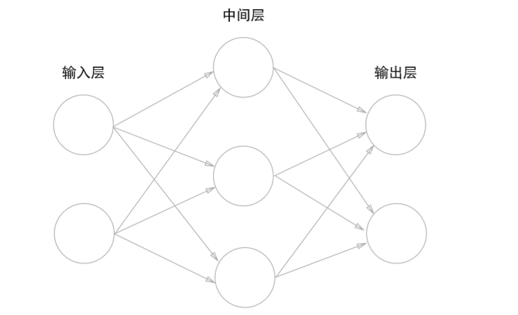
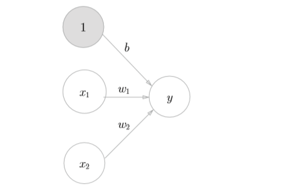
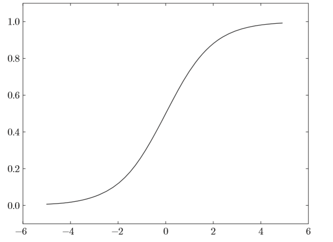
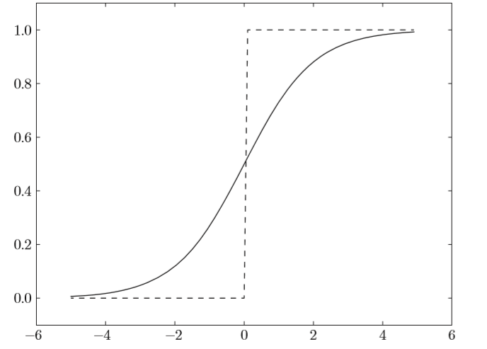
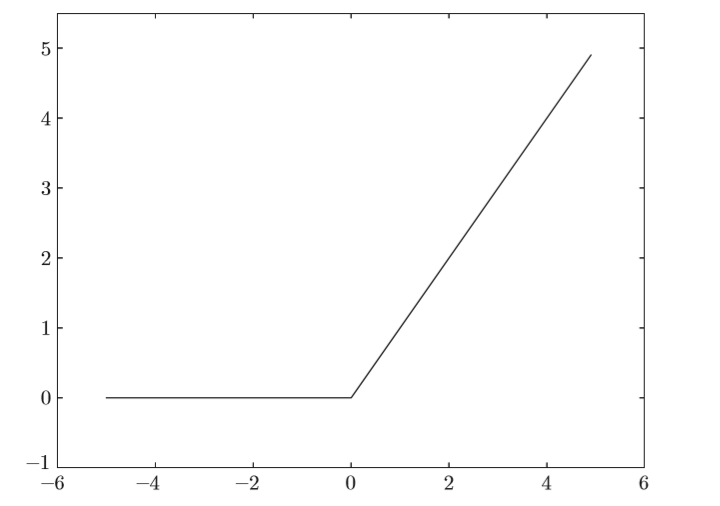

# NN入门，手把手教你用Numpy手撕NN(1)

**这是一篇包含极少数学推导的NN入门文章**

大概从今年4月份起就想着学一学NN，但是无奈平时时间不多，而且空闲时间都拿去做比赛或是看动漫去了，所以一拖再拖，直到这8月份才正式开始NN的学习。

这篇文章主要参考了《深度学习入门：基于Python的理论与实现》一书，感觉这本书很不错，偏向实践，蛮适合入门。

**话不多说，下面开始我们的NN入门(手撕NN)之旅**

## 基础数学知识

这里只对张量进行简单介绍，关于矩阵运算之类的，就靠你们自己另外学啦。

### 标量（0D张量）

仅包含一个数字的张量叫作标量（scalar，也叫标量张量、零维张量、0D 张量）。在 Numpy 中，一个 float32 或 float64 的数字就是一个标量张量（或标量数组）。你可以用 ndim 属性来查看一个 Numpy 张量的轴的个数。

```python
>>> import numpy as np 
>>> x = np.array(1) 
>>> x 
array(1) 
>>> x.ndim 
0
```

### 向量（1D张量）

数字组成的数组叫作向量（vector）或一维张量（1D 张量）。一维张量只有一个轴。下面是 一个 Numpy 向量。

```python
>>> x = np.array([1, 2, 3, 4, 5]) 
>>> x 
array([1, 2, 3, 4, 5]) 
>>> x.ndim 
1 
```

这个向量有5 个元素，也被称为5D 向量。

### 矩阵（2D张量）

向量组成的数组叫作矩阵（matrix）或二维张量（2D 张量）。矩阵有 2 个轴（通常叫作行和列），下面是一个 Numpy 矩阵。

```python
>>> x = np.array([[5, 78, 2, 34, 0],                   
				  [6, 79, 3, 35, 1],                   
				  [7, 80, 4, 36, 2]]) 
>>> x.ndim 
2 
```

第一个轴上的元素叫作行（row），第二个轴上的元素叫作列（column）。在上面的例子中， [5, 78, 2, 34, 0] 是 x 的第一行，[5, 6, 7] 是第一列。

### 3D张量与更高维张量

将多个矩阵组合成一个新的数组，可以得到一个3D 张量，可以将其直观地理解为数字 组成的立方体。下面是一个 Numpy 的 3D 张量。

```python
>>> x = np.array([[[5, 78, 2, 34, 0],                    
				   [6, 79, 3, 35, 1],                    
				   [7, 80, 4, 36, 2]],                   
				  [[5, 78, 2, 34, 0],                    
				   [6, 79, 3, 35, 1],                    
				   [7, 80, 4, 36, 2]],                   
				  [[5, 78, 2, 34, 0],                    
				   [6, 79, 3, 35, 1],                    
				   [7, 80, 4, 36, 2]]]) 
>>> x.ndim  
3 
```

将多个3D 张量组合成一个数组，可以创建一个4D 张量，以此类推。深度学习处理的一般 是 0D 到 4D 的张量，但处理视频数据时可能会遇到 5D 张量。

## 神经网络（Neural Network）

神经网络实际上是由多个`层（神经网络的基本数据结构）`堆叠而成，层是一个数据处理模块，可以将一个 或多个输入张量转换为一个或多个输出张量。下图是一个最简单的网络



这是一个三层神经网络（但实质上只有2层神经元有权重，因此也可称其为“2层网络”），包括`输入层`、`中间层（隐藏层）`和`输出层`。(个人认为，对于任意一个网络，都可以简化成上图所示的一个三层的神经网络，数据从输入层进入，经过一层运算进入隐藏层，然后在隐藏层中进行各种运算，最后再通过一层运算到达输出层，输出我们所需的结果)。

**那么，对于一个最简单的网络，每一层的运算是如何的呢？**



如上图所示，假设我们输入了 $x_1, x_2$， $x_1, x_2$ 分别乘上到下一层的权重，再加上偏置，得到一个y值，这个y值将作为下一层的输入，用公式表达如下
$$
y = w_1x_1+w_2x_2+b {\tag 1}
$$
**可想而知，如果所有的计算都是这样的话，那神经网络就只是一个线性模型，那要如何使其具有非线性呢？**

很简单，可以加入激活函数$h(x)$，那么，我们的公式便可改成
$$
a=w_1x_1+w_2x_2+b {\tag {2.1}}
$$

$$
y=h(a) {\tag {2.2}}
$$

首先，式（2.1）计算加权输入信号和偏置的总和，记为a。然后，式（2.2） 用h(x)函数将a转换为输出y。

### 激活函数

这里介绍下常用的激活函数

#### sigmoid函数

说到非线性，比较容易想到的应该是阶跃函数，比如下面代码所示的

```python
def step_function(x):    
	if x > 0:        
		return 1    
	else:        
		return 0
```

但是，由于阶跃函数只有两个值，不存在平滑性，在计算过程中表示能力肯定不够好，所以，又想到sigmoid函数

```python
def sigmoid(x):    
	return 1 / (1 + np.exp(-x))
```

sigmoid函数的平滑性对神经网络的学习具有重要意义。





#### ReLU函数

在神经网络发展的历史上，sigmoid函数很早就开始被使用了，而最近则主要使用ReLU（Rectified Linear Unit）函数。
$$
h(x)=
\begin{cases}
x,\quad x > 0\\
0,\quad x<=0
\end{cases}
\tag{3}
$$

```python
def relu(x):    
	return np.maximum(0, x)
```



#### 恒等函数和softmax函数（输出层激活函数）

神经网络可以用在分类问题和回归问题上，不过需要根据情况改变输出 层的激活函数。一般而言，回归问题用恒等函数，分类问题用softmax函数。

恒等函数会将输入按原样输出，对于输入的信息，不加以任何改动地直 接输出。因此，在输出层使用恒等函数时，输入信号会原封不动地被输出。 

分类问题中使用的softmax函数可以用下面的式子表示。
$$
y_k = \frac{exp(a_k)}{\sum^n_{i=1}exp(a_i)} \tag{4}
$$

```python
def softmax(a):    
	exp_a = np.exp(a)    
	sum_exp_a = np.sum(exp_a)    
	y = exp_a / sum_exp_a
    return y
```

上面的softmax函数的实现在计算机的运算上存在有溢出问题。softmax函数的实现中要进行指数函数的运算，但是此时指数函数的值很容易变得非常大。比如，$e^{10}$的值 会超过20000，$e^{100}$会变成一个后面有40多个0的超大值，$e^{1000}$的结果会返回 一个表示无穷大的inf。如果在这些超大值之间进行除法运算，结果会出现“不确定”的情况。

因此对softmax做如下改进

```python
def softmax(a):    
	c = np.max(a)    
	exp_a = np.exp(a - c) # 溢出对策    
	sum_exp_a = np.sum(exp_a)    
	y = exp_a / sum_exp_a
    return y
```

### 网络的学习

从之前的介绍来看，设置好神经网络的参数，设置好激活函数，似乎就可以利用该神经网络来做预测了，事实也是入此。但这里存在一个很重要的问题，网络的各个权重参数如何设置？1. 人为设置，这好像就成了人工神经网络，并且十分不现实，一旦网络结构比较大，具有数万个神经元的时候，完全无法设置参数。2. 从数据中学习，这是所有机器学习、深度学习模型的一个很重要的特征，从数据中学习。

下面将介绍神经网络在学习中需要的一些东西

#### 损失函数（loss function）

相信有机器学习基础的对此都不陌生。神经网络每次在学习时，会更新一组权重，通过这组新的权重然后产生一组预测值，那我们如何判断这组权重是否是较优的呢？通过损失函数即可，这里介绍两个损失函数（可跳过）。

> 损失函数是表示神经网络性能的“恶劣程度”的指标，即当前的 神经网络对监督数据在多大程度上不拟合，在多大程度上不一致。 以“性能的恶劣程度”为指标可能会使人感到不太自然，但是如 果给损失函数乘上一个负值，就可以解释为“在多大程度上不坏”， 即“性能有多好”。并且，“使性能的恶劣程度达到最小”和“使性 能的优良程度达到最大”是等价的，不管是用“恶劣程度”还是“优 良程度”，做的事情本质上都是一样的。

##### 均方误差（mean squared error)

$$
E=\frac{1}{2}\sum_k(y_k-t_k)^2 \tag{5}
$$

```python
def mean_squared_error(y, t):    
	return 0.5 * np.sum((y-t)**2)
```

该损失函数常用于回归问题

##### 交叉熵误差（cross entropy error)

$$
E=-\sum_k{t_klogy_k} \tag{6}
$$

```
def cross_entropy_error(y, t):    
	delta = 1e-7    
	return -np.sum(t * np.log(y + delta))
```

这里，参数y和t是NumPy数组。函数内部在计算np.log时，加上了一 个微小值delta。这是因为，当出现np.log(0)时，np.log(0)会变为负无限大的-inf，这样一来就会导致后续计算无法进行。作为保护性对策，添加一个微小值可以防止负无限大的发生。

交叉熵误差常用于分类问题上

#### mini-batch 学习

介绍了损失函数之后，其实已经可以利用损失函数开始训练我们的神经网络了，但是，我们每次训练都不止一条数据，如果想要训练出比较好的神经网络模型，在计算损失函数时就必须将所有的训练数据作为对象。以交叉熵误差为例，损失函数改写成下面的式子
$$
E=-\frac{1}{N}\sum_n\sum_kt_{nk}logy_{nk} \tag{7}
$$
但是，同时需考虑，在MNIST数据集中，训练数据有60000条，如果以全部数据为对象求损失函数的和，则计算过程需要花费较长的时间。再者，如果遇到大数据， 数据量会有几百万、几千万之多，这种情况下以全部数据为对象计算损失函数是不现实的。因此，我们从全部数据中选出一部分，作为全部数据的“近似”。神经网络的学习也是从训练数据中选出一批数据（称为mini-batch,小 批量），然后对每个mini-batch进行学习。比如，从60000个训练数据中随机选择200笔，再用这200笔数据进行学习。这种学习方式称为mini-batch学习。 

此时交叉熵代码实现如下

```python
def cross_entropy_error(y, t):    
	if y.ndim == 1:        
		t = t.reshape(1, t.size)        
		y = y.reshape(1, y.size)
        
    batch_size = y.shape[0]    
    return -np.sum(t * np.log(y + 1e-7)) / batch_size
```

当监督数据是标签形式（非one-hot表示，而是像“2”“ 7”这样的标签）时，交叉熵误差可通过如下代码实现。

```python
def cross_entropy_error(y, t):    
	if y.ndim == 1:        
		t = t.reshape(1, t.size)        
		y = y.reshape(1, y.size)
    batch_size = y.shape[0]    
    return -np.sum(np.log(y[np.arange(batch_size), t] + 1e-7)) / batch_size
```

#### 参数（权重和偏置）优化

上面介绍了更新权重时需要的损失函数，但是，我们要如何利用损失函数来更新权重呢？这里用到了我们熟知的梯度法。

##### 梯度法

机器学习的主要任务是在学习时寻找最优参数。同样地，神经网络也必 须在学习时找到最优参数（权重和偏置）。这里所说的最优参数是指损失函数取最小值时的参数。但是，一般而言，损失函数很复杂，参数空间庞大，我 们不知道它在何处能取得最小值。而通过巧妙地使用梯度来寻找函数最小值 （或者尽可能小的值）的方法就是梯度法，数学表示如下
$$
x_0=x_0-\eta \frac{\partial f}{\partial x_0} \\
x_1=x_1-\eta \frac{\partial f}{\partial x_1} \tag{8}
$$
式中η表示更新量，在神经网络的学习中，称为`学习率（learning rate）`。学习率决定在一次学习中，应该学习多少，以及在多大程度上更新参数。 

```python
def numerical_gradient(f, x):    
    h = 1e-4 # 0.0001    
    grad = np.zeros_like(x) # 生成和x形状相同的数组
    it = np.nditer(x, flags=['multi_index'], op_flags=['readwrite'])
    while not it.finished:
        idx = it.multi_index
        tmp_val = x[idx]        
        # f(x+h)的计算        
        x[idx] = tmp_val + h        
        fxh1 = f(x)
        
        # f(x-h)的计算        
        x[idx] = tmp_val - h        
        fxh2 = f(x)
        grad[idx] = (fxh1 - fxh2) / (2*h)
        
        x[idx] = tmp_val # 还原值
        it.iternext()
        
    return grad

def gradient_descent(f, init_x, lr=0.01, step_num=100):    
	x = init_x
    for i in range(step_num):        
    	grad = numerical_gradient(f, x)        
    	x -= lr * grad
    	
    return x
```

`参数f`是要进行最优化的函数，`init_x`是初始值，`lr`是学习率learning rate，`step_num`是梯度法的重复次数。`numerical_gradient(f,x)`会求函数的梯度，用该梯度乘以学习率得到的值进行更新操作，由step_num指定重复的 次数。 

学习率需要事先确定为某个值，比如0.01或0.001。一般而言，这个值 过大或过小，都无法抵达一个“好的位置”。在神经网络的学习中，一般会 一边改变学习率的值，一边确认学习是否正确进行了。

##### 神经网络的梯度

$$
\mathbf{W}=\left(
	\begin{matrix}
	w_{11} & w_{12} & w_{13} \\
    w_{21} & w_{22} & w_{23}
	\end{matrix}
\right) \\
\frac{\partial L}{\partial \mathbf{W}} = \left(
	\begin{matrix}
	\frac{\partial L}{\partial w_{11}} & \frac{\partial L}{\partial w_{12}} &\frac{\partial L}{\partial w_{13}} \\
	\frac{\partial L}{\partial w_{21}} & \frac{\partial L}{\partial w_{22}} &\frac{\partial L}{\partial w_{23}}
	\end{matrix}
\right) \tag{9}
$$

就是需要一个一个算比较麻烦，但是计算机就无所谓了

迭代伪代码如下

```python
 def f(W):    
	 return net.loss(x, t) 
	 
 dW = numerical_gradient(f, net.W) 
```

#### 学习算法的实现

根据前面的介绍，差不多可以理清神经网络的学习步骤了

1. **mini-batch**

   从训练数据中随机选出一部分数据，这部分数据称为mini-batch。我们 的目标是减小mini-batch的损失函数的值。

2. **梯度计算**

   为了减小mini-batch的损失函数的值，需要求出各个权重参数的梯度。 梯度表示损失函数的值减小最多的方向。

3. **更新参数**

   将权重参数沿梯度方向进行微小更新。

4. **迭代**

   重复步骤1、步骤2、步骤3。

神经网络的学习按照上面4个步骤进行。这个方法通过梯度下降法更新参数，不过因为这里使用的数据是随机选择的mini batch数据，所以又称为 `随机梯度下降法（stochastic gradient descent）`。

下面给出一个两层的简单神经网络的实现

```python
class TwoLayerNet:
    def __init__(self, input_size, hidden_size, output_size,                 weight_init_std=0.01):
        """
        :param: input_size - 输入层的神经元数
        :param: hidden_size - 隐藏层的神经元数
        ;param: output_size - 输出层的神经元数
        """
    	# 初始化权重        
    	self.params = {}        
    	self.params['W1'] = weight_init_std * np.random.randn(input_size, hidden_size)       
    	self.params['b1'] = np.zeros(hidden_size)        
    	self.params['W2'] = weight_init_std * np.random.randn(hidden_size, output_size)           self.params['b2'] = np.zeros(output_size)

	def predict(self, x):        
		W1, W2 = self.params['W1'], self.params['W2']        
		b1, b2 = self.params['b1'], self.params['b2']
        a1 = np.dot(x, W1) + b1        
        z1 = sigmoid(a1)        
        a2 = np.dot(z1, W2) + b2        
        y = softmax(a2)
        return y
 	
 	 # x:输入数据, t:监督数据    
 	 def loss(self, x, t):        
 	 	y = self.predict(x)
        return cross_entropy_error(y, t)
    
    def accuracy(self, x, t):        
    	y = self.predict(x)        
    	y = np.argmax(y, axis=1)        
    	t = np.argmax(t, axis=1)
        accuracy = np.sum(y == t) / float(x.shape[0])        
        return accuracy
 
 	 # x:输入数据, t:监督数据    
 	 def numerical_gradient(self, x, t):        
 	 	loss_W = lambda W: self.loss(x, t)
        grads = {}        
        grads['W1'] = numerical_gradient(loss_W, self.params['W1'])        
        grads['b1'] = numerical_gradient(loss_W, self.params['b1'])        
        grads['W2'] = numerical_gradient(loss_W, self.params['W2'])        
        grads['b2'] = numerical_gradient(loss_W, self.params['b2'])
        
        return grads

```

训练

```python
# 数据加载代码
try:
    import urllib.request
except ImportError:
    raise ImportError('You should use Python 3.x')
import os.path
import gzip
import pickle
import os
import numpy as np
url_base = 'http://yann.lecun.com/exdb/mnist/'
key_file = {
    'train_img':'train-images-idx3-ubyte.gz',
    'train_label':'train-labels-idx1-ubyte.gz',
    'test_img':'t10k-images-idx3-ubyte.gz',
    'test_label':'t10k-labels-idx1-ubyte.gz'
}

dataset_dir = os.path.dirname(os.path.abspath(__file__))
save_file = dataset_dir + "/mnist.pkl"

train_num = 60000
test_num = 10000
img_dim = (1, 28, 28)
img_size = 784

def _download(file_name):
    file_path = dataset_dir + "/" + file_name

    if os.path.exists(file_path):
        return

    print("Downloading " + file_name + " ... ")
    urllib.request.urlretrieve(url_base + file_name, file_path)
    print("Done")

def download_mnist():
    for v in key_file.values():
       _download(v)

def _load_label(file_name):
    file_path = dataset_dir + "/" + file_name

    print("Converting " + file_name + " to NumPy Array ...")
    with gzip.open(file_path, 'rb') as f:
            labels = np.frombuffer(f.read(), np.uint8, offset=8)
    print("Done")

    return labels

def _load_img(file_name):
    file_path = dataset_dir + "/" + file_name

    print("Converting " + file_name + " to NumPy Array ...")
    with gzip.open(file_path, 'rb') as f:
            data = np.frombuffer(f.read(), np.uint8, offset=16)
    data = data.reshape(-1, img_size)
    print("Done")

    return data

def _convert_numpy():
    dataset = {}
    dataset['train_img'] =  _load_img(key_file['train_img'])
    dataset['train_label'] = _load_label(key_file['train_label'])
    dataset['test_img'] = _load_img(key_file['test_img'])
    dataset['test_label'] = _load_label(key_file['test_label'])

    return dataset

def init_mnist():
    download_mnist()
    dataset = _convert_numpy()
    print("Creating pickle file ...")
    with open(save_file, 'wb') as f:
        pickle.dump(dataset, f, -1)
    print("Done!")

def _change_one_hot_label(X):
    T = np.zeros((X.size, 10))
    for idx, row in enumerate(T):
        row[X[idx]] = 1

    return T

def load_mnist(normalize=True, flatten=True, one_hot_label=False):
    if not os.path.exists(save_file):
        init_mnist()

    with open(save_file, 'rb') as f:
        dataset = pickle.load(f)

    if normalize:
        for key in ('train_img', 'test_img'):
            dataset[key] = dataset[key].astype(np.float32)
            dataset[key] /= 255.0

    if one_hot_label:
        dataset['train_label'] = _change_one_hot_label(dataset['train_label'])
        dataset['test_label'] = _change_one_hot_label(dataset['test_label'])

    if not flatten:
         for key in ('train_img', 'test_img'):
            dataset[key] = dataset[key].reshape(-1, 1, 28, 28)

    return (dataset['train_img'], dataset['train_label']), (dataset['test_img'], dataset['test_label'])
```

```python
# NN训练代码
(x_train, t_train), (x_test, t_test) = load_mnist(normalize=True, one_hot_ laobel = True)
train_loss_list = [] 
train_acc_list = [] 
test_acc_list = [] 
# 平均每个epoch的重复次数 
iter_per_epoch = max(train_size / batch_size, 1)

# 超参数 
iters_num = 10000 
batch_size = 100 
learning_rate = 0.1

network = TwoLayerNet(input_size=784, hidden_size=50, output_size=10)

for i in range(iters_num):    
	# 获取mini-batch    
	batch_mask = np.random.choice(train_size, batch_size)    
	x_batch = x_train[batch_mask]    
	t_batch = t_train[batch_mask]
    # 计算梯度    
    grad = network.numerical_gradient(x_batch, t_batch)    
    # grad = network.gradient(x_batch, t_batch) # 高速版!
    
    # 更新参数    
    for key in ('W1', 'b1', 'W2', 'b2'):        n
    	etwork.params[key] -= learning_rate * grad[key]
    loss = network.loss(x_batch, t_batch)    
    train_loss_list.append(loss)    
    # 计算每个epoch的识别精度    
    if i % iter_per_epoch == 0:        
    	train_acc = network.accuracy(x_train, t_train)        
    	test_acc = network.accuracy(x_test, t_test)        
    	train_acc_list.append(train_acc)        
    	test_acc_list.append(test_acc)        
    	print("train acc, test acc | " + str(train_acc) + ", " + str(test_acc))

```

## 小节

这篇中介绍了NN的一些基础知识，也给出了一个用numpy实现的十分简单的一个2层神经网络的实现，将在下篇中介绍反向传播法，对现在实现的神经网络进行更进一步的优化。

本文首发于[我的知乎](https://zhuanlan.zhihu.com/c_1092003351746777088)