# NN入门，手把手教你用Numpy手撕NN(2)

**这是一篇包含极少数学推导的NN入门文章**

上篇[文章](NN入门(1).md)中简单介绍了如何手撕一个NN，但其中仍有可以改进的地方，将在这篇文章中进行完善。

## 误差反向传播

之前的NN计算梯度是利用数值微分法，虽容易实现，但是计算速度慢，这里介绍的`误差反向传播法`能够高效计算权重参数的梯度的方法。

**这里将通过`计算图`的方法来讲解反向传播**

### 计算图

>  问题一：
>
> ​	小明在超市买了2个100元一个的苹果，消费税是10%，请计算支付金额

​	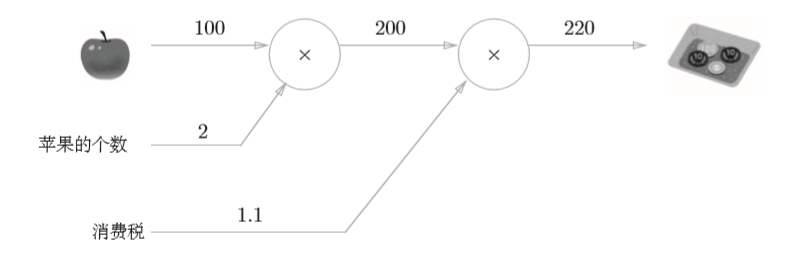


> 问题二：
>
> ​	小明在超市买了2个苹果、3个橘子。其中，苹果每个100元， 橘子每个150元。消费税是10%，请计算支付金额。


从上面两问计算图的表示中可以很容易理解其计算原理，从左到右的计算称为`正向传播`。同时，我们也可以利用这种方法进行`反向传播`。

> 再来思考一个问题：
>
> ​	问题1中，我们计算了购买2个苹果时加上消费税最终需要支付的金额。这里，假设我们想知道苹果价格的上涨会在多大程度上影响最终的支付金额，即求“支付金额关于苹果的价格的导数”。

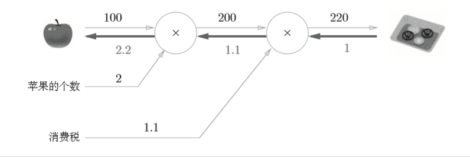

如上图所示，反向传播使用与正方向相反的箭头（粗线）表示。反向传播传递“局部导数”，将导数的值写在箭头的下方。在这个例子中，反向传播从右向左传递导数的值（1→1.1→2.2）。从这个结果中可知，“支付金额 关于苹果的价格的导数”的值是2.2。这意味着，如果苹果的价格上涨1元， 最终的支付金额会增加2.2元（严格地讲，如果苹果的价格增加某个微小值， 则最终的支付金额将增加那个微小值的2.2倍）。 

可见，利用计算图可以通过正向传播与反向传播高效地计算各个变量的导数值。

### 链式法则

上面提到的反向传播实际上是基于链式法则进行的，这里将介绍下其原理。

假设存在 $y=f(x)$ 的计算，这个计算的反向传播如下图所示

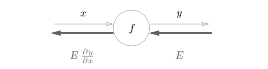

如图所示，反向传播的计算顺序是，将信号E乘以节点的局部导数 ，然后将结果传递给下一个节点。通过这样的计算，可以高效地求出导数的 值，这是反向传播的要点。

**然而，为什么链式传播在这里会有效呢?**

学过高数话，就知道什么是链式传播

>如果某个函数由复合函数表示，则该复合函数的导数可以用构成复合函数的各个函数的导数的乘积表示。

以 $z=(x+y)^2$ 为例，可以看成由下面两个式子构成
$$
z=t^2 \\
t=x+y \tag{1}
$$
那么
$$
\frac{\partial z}{\partial x} = \frac{\partial z}{\partial t} \frac{\partial t}{\partial x}\tag{2}
$$
现在来使用链式法则
$$
\frac{\partial z}{\partial t} = 2t\\
\frac{\partial t}{\partial x} = 1\tag{3}
$$
所以
$$
\frac{\partial z}{\partial x} = 2t \cdot 1=2(x+y)\tag{4}
$$
将上式按照计算图表示如下


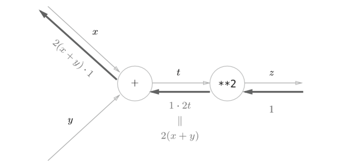

这样，我们的反向传播就算介绍完了，下面将介绍简单实现。

### 乘法层

```python
class MulLayer:    
	def __init__(self):        
		self.x = None        
		self.y = None
    
    def forward(self, x, y):        
    	self.x = x        
    	self.y = y        
    	out = x * y
        
        return out
        
    def backward(self, dout):        
    	dx = dout * self.y # 翻转x和y        
    	dy = dout * self.x
        
        return dx, dy
```

__ init __()中会初始化实例变量x和y，它们用于保存正向传播时的输入值。 forward()接收x和y两个参数，将它们相乘后输出。backward()将从上游传来的导数（dout）乘以正向传播的翻转值，然后传给下游。 

至于为什么要翻转x和y可能会有点迷惑，看下面这张图再结合上面的例子就能理解了

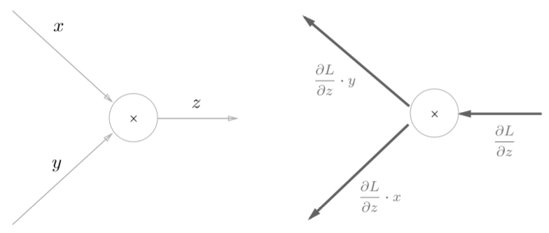

**使用**

```python
apple = 100 
apple_num = 2 
tax = 1.1
# layer 
mul_apple_layer = MulLayer() 
mul_tax_layer = MulLayer()
# forward 
apple_price = mul_apple_layer.forward(apple, apple_num) 
price = mul_tax_layer.forward(apple_price, tax)
print(price) # 220

# backward 
dprice = 1 
dapple_price, dtax = mul_tax_layer.backward(dprice) 
dapple, dapple_num = mul_apple_layer.backward(dapple_price)
print(dapple, dapple_num, dtax) # 2.2 110 200
```

### 加法层

```python
class AddLayer:    
	def __init__(self):        
		pass
    
    def forward(self, x, y):        
    	out = x + y        
    	return out
    
    def backward(self, dout):        
    	dx = dout * 1        
    	dy = dout * 1        
    	return dx, dy
```

加法层不需要特意进行初始化，所以__ init __()中什么也不运行。加法层的forward()接收x和y两个参数，将它们相加后输出。backward()将上游传来的导数（dout）原封不动地传递给下游。 

## NN各层实现

前面介绍了如何利用计算图来计算导数，下面将介绍如何利用计算图来设计NN的其它层。

### 激活函数层

#### ReLU层

$$
y=\begin{cases}
x,\quad x > 0\\
0,\quad x<=0
\end{cases}\tag{5}
$$

对上式求导
$$
\frac{\partial y}{\partial x}=\begin{cases}
1,\quad x > 0\\
0,\quad x<=0
\end{cases}\tag{6}
$$
可以看出，如果正向传播时的输入x大于0，则反向传播会将上游的值原封不动地传给下游。反过来，如果正向传播时的x小于等于0，则反向传播中传给下游的信号将停在此处。计算图表示如下

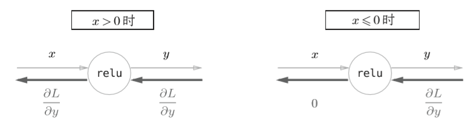

```python
class Relu:    
	def __init__(self):        
		self.mask = None
    
    def forward(self, x):        
    	self.mask = (x <= 0)        
    	out = x.copy()        
    	out[self.mask] = 0
        
        return out
    
    def backward(self, dout):        
    	dout[self.mask] = 0        
    	dx = dout
        
        return dx
```

#### Sigmoid层

$$
y=\frac{1}{1+exp(-x)}\tag{7}
$$

其正向传播的计算图可以表示如下

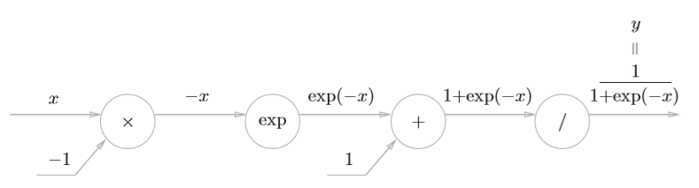

那么，依次进行求导

节点“/”

$$
y=\frac{1}{x} \\
\frac{\partial y}{\partial x} = -\frac{1}{x^2}=-y^2\tag{8}
$$
节点“+”

​	原封不动传给下一节点

节点“exp”
$$
\frac{\partial y}{\partial x} = exp(x)\tag{9}
$$
节点“x”

​	上一节点的传来的导数乘上-1

最后计算图表示如下

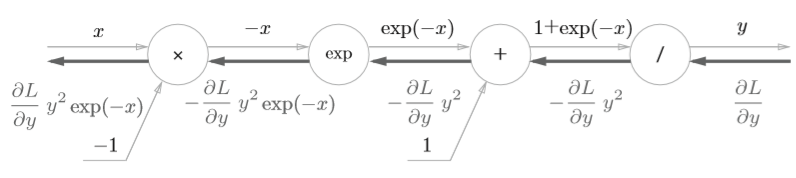

化简一下就是

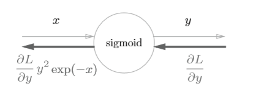

这里还能将公式进一步化简
$$
\begin{aligned}
\frac{\partial L}{\partial y}y^2\exp(-x) &= \frac{\partial L}{\partial y}\frac{1}{(1+\exp{-x})^2}\exp(-x)\\
&=\frac{\partial L}{\partial y}\frac{1}{1+\exp{-x}}\frac{\exp{-x}}{1+\exp{-1}}\\
&= \frac{\partial L}{\partial y}y(1-y)
\end{aligned} \tag{10}
$$
此时计算图为

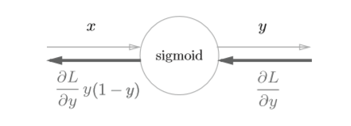

```python
class Sigmoid:    
	def __init__(self):        
		self.out = None
    
    def forward(self, x):        
    	out = 1 / (1 + np.exp(-x))        
    	self.out = out
        
        return out
    
    def backward(self, dout):        
    	dx = dout * (1.0 - self.out) * self.out
        
        return dx

```

### Affine/Softmax层

#### Affine

> 神经网络的正向传播中进行的矩阵的乘积运算在几何学领域被称为“仿射变换” A。因此，这里将进行仿射变换的处理实现为“Affine层”。

对于矩阵运算的反向传播实现，涉及到了对矩阵求导，之前看到一篇很好的[文章](https://zhuanlan.zhihu.com/p/22473137)，里面介绍了如何进行计算。这里将直接给出结论，对下图
$$
\frac{\partial L}{\partial X}=\frac{\partial L}{\partial Y} \cdot W^T \\
\frac{\partial L}{\partial W}=X^T \cdot \frac{\partial L}{\partial X} \tag{11}
$$
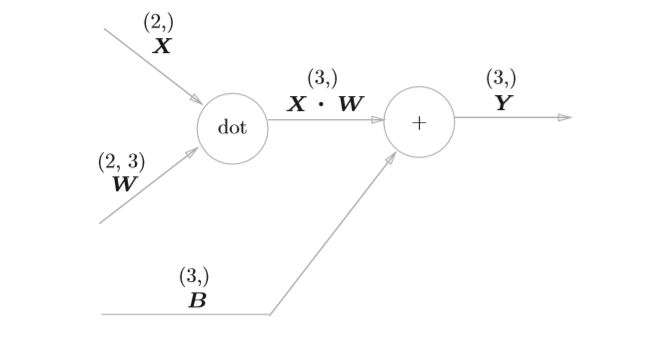

反向传播的计算图

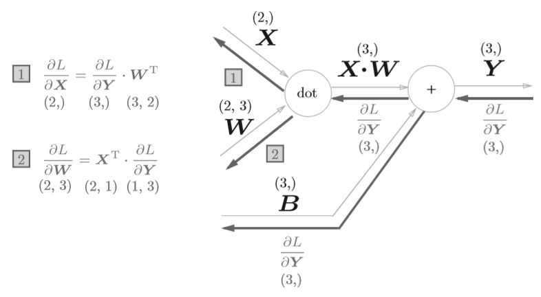

上面只是以单个数据为对象，如果是N个数据一起进行正向传播呢？先来看看计算图表示

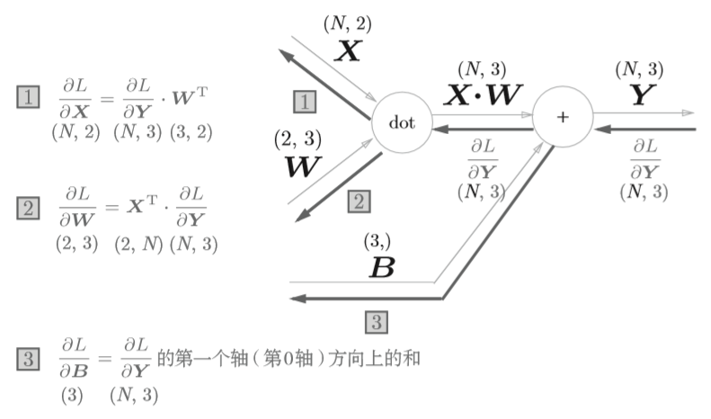

代码如下

```python
Class Affine:
	def __init__(self, W, b):
		self.W = W
        self.b = b
        self.x = None
        self.dW = None
        self.db = None
       
    def forward(self, x):
        self.x = x
        out = np.dot(x, self.W) + self.b
        
        return out
    
    def backward(self, dout):
        dx = np.dot(dout, self.W.T)
        self.dW = np.dot(self.x.T, dout)
        self.db = np.sum(dout, axis=1)
        
        return dx
```

#### Softmax-with-Loss

Softmax-with-loss层由Softmax层与Cross Entropy Error层组合而成，其结构如下所示

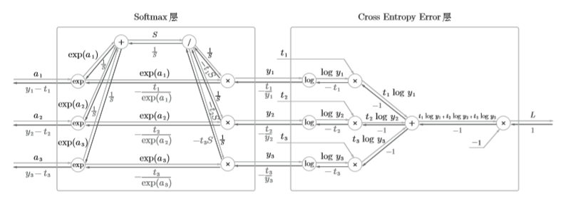

**公式表示**

Softmax
$$
y_k=\frac{\exp{(a_k)}}{\sum^{n}_{i=1}\exp{(a_i)}}\tag{12}
$$
Cross Entropy Error
$$
L=-\sum_{k}t_klogy_k\tag{13}
$$
**Cross Entropy Error 反向传播**

+ 初始值为1
+ "x"节点的反向传播将正向传播时的输入值翻转，乘以上游传来的导数后，再传给下游
+ "+"节点将上游传来的导数原封不动传给下游
+ "log"节点的反向传播如下式

$$
y=logy\\
\frac{\partial y}{\partial x} = \frac{1}{x} \tag{14}
$$

综上，可求得Cross Entropy Error层的反向传播的结果为 $(-\frac{t_1}{y_1},-\frac{t_2}{y_2},-\frac{t_3}{y_3})$ 。

**Softmax层反向传播**
$$
\left. 
\begin{gathered}
y_i=\frac{\exp{(a_i)}}{S} \\
-\frac{t_i}{y_i}\exp{(a_i)}
\end{gathered} 
\right\}
\implies -t_i\frac{S}{\exp{(a_i)}}\exp{(a_i)}=-t_iS \tag{15}
$$
"/"节点反向传播为$-\frac{1}{S^2}$

所以，Softmax层中间最上面的结果为$\frac{1}{S}(t_1+t_2+t_3)$，由于$t_1, t_2, t_3$为one-hot表示，所以仅有一个的值为1，所以此处导数为$\frac{1}{S}$。

“/”节点后的''+"节点，原封不动传递上游的值，此时反向传播计算图如下所示

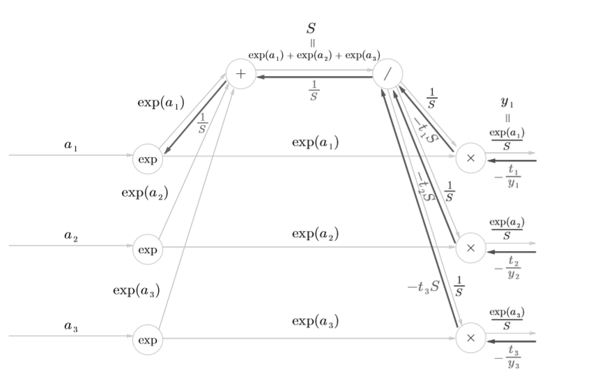

接着是中间的横向"x"节点，将值翻转后相乘
$$
-\frac{t_i}{y_i}\frac{1}{S}=-\frac{t_i}{\exp{(a_i)}}\tag{16}
$$
然后就是"exp"节点
$$
y=\exp{(x)}\\
\frac{\partial y}{\partial x}=\exp{(x)} \tag{17}
$$
根据上式，两个分支输入和乘以$\exp(a_i)$后的值就是所求的反向传播值。
$$
\left. 
\begin{gathered}
y_i=\frac{\exp{(a_i)}}{S} \\
(\frac{1}{S}-\frac{t_i}{\exp{(a_i)}})\exp{(a_i)}
\end{gathered} 
\right\}
\implies y_i-t_i \tag{18}
$$


到此为止，Softmax-with-Loss层的反向传播就算好了，下面来看看代码

```python
Class SoftWithLoss:
    def __init__(self):
        self.loss = None # 损失
        self.y = None # softmax的输出
        self.t = None # 监督输出(one-hot vector)
        
    def forward(self, x, t):
        self.t = t
        self.y = softmax(x)
        self.loss = cross_entropy_error(self.y, self.t)
        
        return self.loss
    
    def backward(self, dout=1):
        batch_size = self.t.shape[0]
        dx = (self.y - self.t) / batch_size # 请注意反向传播时，需除以批的大小（batch_size）
        
        return dx
```

## 使用反向传播的NN实现

上面介绍了各层如何利用反向传播进行实现，这里将介绍利用反向传播构建NN。

### 神经网络学习步骤

1. 步骤一（mini-batch）

   从训练数据中随机选择一部分数据

2. 步骤二（计算梯度）

   计算损失函数关于各个权重参数的梯度

3. 步骤三（更新参数）

   将权重参数沿梯度方向进行微小的更新

4. 步骤四（重复）

   重复步骤一、二、三

反向传播将出现在步骤二中。

先来个简单的两层NN

```python
import sys, os
sys.path.append(os.pardir)
import numpy as np
from collections import OrderDict

Class TwoLayerNet:
    def __init__(self, input_size, hidden_size, output_size, weight_init_std=0.01):
        # 初始化权重
        self.params = {}
        self.params['W1'] = weight_init_std * np.random.randn(input_size, hidden_size)
        self.params['b1'] = np.zeros(hidden_size)
        self.params['W2'] = weight_init_std * np.random.randn(hidden_size, output_size)
        self.params['b2'] = np.zeros(output_size)
        
    	# 生成层
        self.layers = OrderdDict()
        self.layers['Affine1'] = Affine(self.params['W1'], self.params['b1'])
        self.layers['Relu1'] = Relu()
        self.layers['Affine2'] = Affine(self.params['W2'], self,params['b2'])
        self.lastLayer = SoftmaxWithLoss()
        
    def predict(self, x):
        for layer in self.layers.values():
            x = layer.forward(x)
        
        return x
    
    # x: 输入数据, t：监督数据
    def loss(self, x, t):
        y = self.predict(x)
        return self.lastLayer.forward(x, y)
    
    def accuracy(self, x, t):
        y = self.predict(x)
        y = np.argmax(y, axis=1)
        if t.ndim != 1 :
            t = np.argmax(t, axis=1)
        accuracy = np.sum(y==t) / float(x.shape[0])
        return accuracy
    
    # x：输入数据，t：监督数据 微分法梯度计算
    def numerical_gradient(self, x, t):
        loss_W = lambda W: self.loss(x, t)
        
        grads = {}
        grads['W1'] = numerical_gradient(loss_W, self.params['W1'])
        grads['b1'] = numerical_gradient(loss_W, self.params['b1'])
        grads['W2'] = numerical_gradient(loss_W, self.params['W2'])
        grads['b2'] = numerical_gradient(loss_W, self.params['b2'])
        
        return grads
    
    # x：输入数据，t：监督数据 计算图法梯度计算
    def gradient(self, x, t):
        # forward
        self.loss(x, t)
        # backward
        dout = 1
        dout = self.lastLayer.backward(dout)
        
        layers = list(self.layers.values()).reverse()
        for layer in layers:
            dout = layer.backward(dout)
        
        grads = {}
        grads['W1'] = self.layers['Affine1'].dW
        grads['b1'] = self.layers['Affine1'].db
        grads['W2'] = self.layers['Affine2'].dW
        grads['b2'] = self.layers['Affine2'].db
        
        return grads
```

这里插入一点内容，我们之前使用的数值微分的优点是实现简单，因此，一般情况下不太容易出错。而误差反向传播法的实现很复杂，容易出错。所以，经常会比较数值微分的结果和误差反向传播法的结果，以确认误差反向传播法的实现是否正确。确认数值微分求出的梯度结果和误差反向传播法求出的结果是否一致<u>（严格地讲，是非常相近）</u>的操作称为梯度确认（gradient check）。

代码实现如下

```python
# 读入数据 
(x_train, t_train), (x_test, t_test) = load_mnist(normalize=True, one_ hot_label = True)
network = TwoLayerNet(input_size=784, hidden_size=50, output_size=10)

x_batch = x_train[:3]
t_batch = t_train[:3]

grad_numerical = network.numerical_gradient(x_batch, t_batch) 
grad_backprop = network.gradient(x_batch, t_batch)

# 求各个权重的绝对误差的平均值 
for key in grad_numerical.keys():    
	diff = np.average(np.abs(grad_backprop[key] - grad_numerical[key]))    
	print(key + ":" + str(diff))

```

使用上面的网络进行学习

```python
import sys, os 
sys.path.append(os.pardir) 
import numpy as np

# 读入数据 
(x_train, t_train), (x_test, t_test) = load_mnist(normalize=True, one_hot_label=True)
network = TwoLayerNet(input_size=784, hidden_size=50, output_size=10)

iters_num = 10000 
train_size = x_train.shape[0] 
batch_size = 100 
learning_rate = 0.1 
train_loss_list = [] 
train_acc_list = [] 
test_acc_list = []

iter_per_epoch = max(train_size / batch_size, 1)

for i in range(iters_num):    
	batch_mask = np.random.choice(train_size, batch_size)    
	x_batch = x_train[batch_mask]    
	t_batch = t_train[batch_mask]
    
    # 通过误差反向传播法求梯度    
    grad = network.gradient(x_batch, t_batch)
    
    # 更新    
    for key in ('W1', 'b1', 'W2', 'b2'):        
    	network.params[key] -= learning_rate * grad[key]
    
    loss = network.loss(x_batch, t_batch)    
    train_loss_list.append(loss)
    
    if i % iter_per_epoch == 0:        
    	train_acc = network.accuracy(x_train, t_train)        
    	test_acc = network.accuracy(x_test, t_test)        
    	train_acc_list.append(train_acc)        
    	test_acc_list.append(test_acc)        
    	print(train_acc, test_acc)
```

***注：数据加载与微分求导的代码在上篇中已给出***

这样我们就完成了一个利用误差反向传播实现的简单的两层NN，当然，代码可以更加一般化，生成多层的全连接神经网络，可能将在后面的文章中给出其实现。

## 小节

这篇中介绍了基于反向传播法，对上篇中实现的两层神经网络进行了更进一步的优化。在NN的参数更新方面，还有待优化，其方法有许多，如SGD、Momentum、AdaGrad、Adam等方法；另外还有对于权重的初始值的设置，也有蛮多的研究；以及如何抑制过拟合等，这些都得去了解，并思考其中原理。

本文首发于[我的知乎](https://zhuanlan.zhihu.com/c_1092003351746777088)

