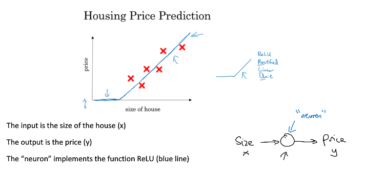
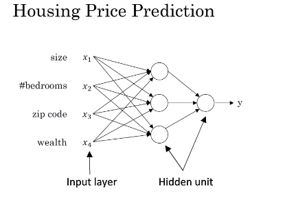
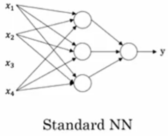
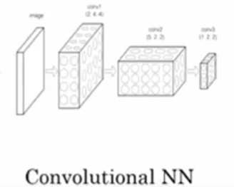
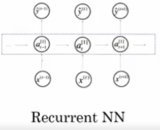
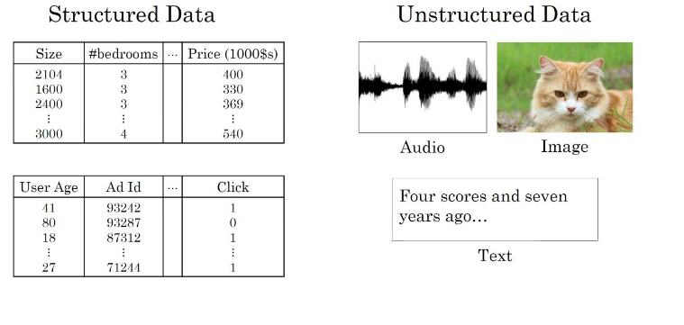
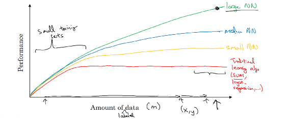
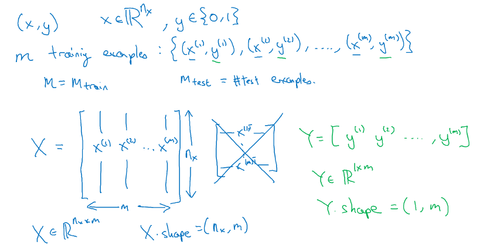
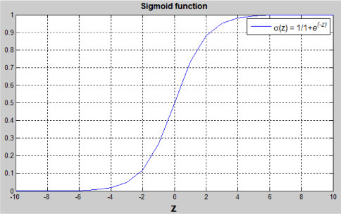

# 1.神经网络和深度学习
## 1.1 介绍
### 什么是神经网络
一种模仿大脑工作方式的强大的学习算法  
1. 单神经网络  
    

2. 多重神经网络
    

### 用神经网络进行监督学习 
一些例子
输入（x） |  输出（y） |  应用 
:------: | :---------: | :------------:
房屋特征 | 价格 | 房地产(std NN)
广告、用户信息 | 是否点击广告 | 在线广告(std NN)
图片 | 标签 | 图像识别(CNN)
音频片段 | 文本 | 音频识别(RNN)
英语 | 中文 | 机器翻译(RNN)
图片、雷达信息 | 汽车位置| 自动驾驶(Hybrid NN )

1. 标准神经网络

    

  

2. 卷积神经网络  
+ 通常用于图像处理
    

  
3. 循环神经网络  
+ 十分适合处理以为序列数据

- 包含时间成分

  

结构化数据：每个特征都有清晰的定义 (数据库数据) 
非结构化数据：特征可能是像素、文本中的单词  

### 为什么神经网络会突然兴起
+ CPU 和 GPU 的发展

+ 大量的数据

+ 算法不断优化，计算速度加快  

  

## 1.2 神经网络的编程基础
### 几个符号的意义  
+ nx 表示维度

+ 在神经网络中一般表示法为
$$
X = 
\left[
\begin{matrix}
 x^{(1)} & x^{(2)} & \cdots & x^{(m)} \\
\end{matrix}
\right]
$$

+ m training example:  
$$
\left\{
\begin{matrix}
(x^{(1)},y^{(1)}) , (x^{(2)},y^{(2)}), ... ,(x^{(m)},y^{(m)})
\end{matrix}
\right\}
$$

### logistic回归
适用于二分分类的算法，用于估计某事物的可能性。  
logistic分布表达式
 $ F(x) = P(X<=x)=\frac{1}{1+e^{\frac{-(x-\mu)}{\gamma}}} ​$  
 $ f(x) = F^{'}(x)=\frac{e^{\frac{-(x-\mu)}{\gamma}}}{\gamma(1+e^{\frac{-(x-\mu)}{\gamma}})^{2}} ​$  

函数图像

分布函数属于逻辑斯谛函数，以点 $(\mu,\frac{1}{2})$ 为中心对称  

逻辑回归是一种学习算法，用于有监督学习问题时，输出y都是0或1。逻辑回归的目标是最小化预测和训练数据之间的误差。  

例子：识别图片中是否是猫  

给一张由特征向量 $x$ 表示的图片，算法将会估计猫在图片中出现的概率

$$
Given\,x,\; \hat{y}=P(y=1|x),where\,0 \le \hat{y} \le 1
$$

用到的参数：

  + 输入特征向量： $x \in \mathbb{R}^{n_{x}} $, $n_{x}​$表示特征数量
  + 训练标签：$t \in 0,1​$
  + 权重：$w \in \mathbb{R}^{n_{x}}​$
  + 阈值：$b \in \mathbb{R}​$
  + 输出：$\hat{y}=\sigma(w^Tx+b)$
  + $\sigma$函数：$s=\sigma(w^Tx+b)=\sigma(z)=\frac{1}{1+e^{-z}}​$

$(w^Tx+b)​$是一个线性函数，但是因为我们寻找的是[0,1]间的概率约束，所以使用了sigmoid函数。函数的界在[0,1]之间，如图所示。

### logistic回归损失函数

## 1.3 编写单隐层神经网络

## 1.4 建立多层的深层神经网络

# 2.改进深度神经网络：超参数调整，正则化和优化
# 3.构建你的机器学习项目
# 4.卷积神经网络
# 5.自然语言处理：建立序列模型