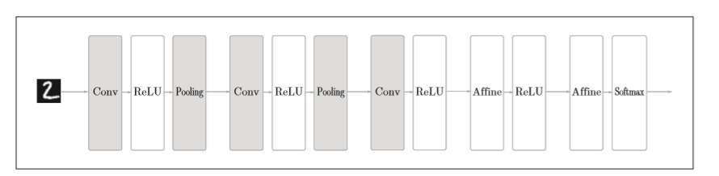
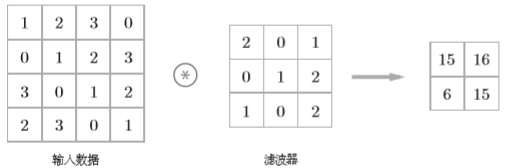

# NN入门，手把手教你用Numpy手撕NN(3)

**这是一篇包含极少数学的CNN入门文章**

上篇[文章](NN入门(2).md)中简单介绍了NN的反向传播，并利用反向传播实现了一个简单的NN，在这篇文章中将介绍一下CNN。

## CNN

CV（计算机视觉）作为AI的一大研究方向，越来越多的人选择了这个方向，其中使用的深度学习的方法基本以卷积神经网络（CNN）为基础。因此，这篇文章将介绍CNN的实现。

CNN与我们之前介绍的NN的相比，出现了卷积层(Convolution层)和池化层(Pooling层)。其网络架构大致如下图所示

### 卷积层

为什么在有存在全连接神经网络的情况下还会出现卷积神经网络呢？

这就得来看看全连接神经网络存在的问题了，全连接神经网络中存在的问题是数据的形状被“忽略了”。比如，输入的数据是图像时，图像通常是高、长、通道方向上的3为形状。

但是，全连接层输入时，需要将3维数据拉平为1维数据，因此，我们可能会丢失图像数据中存在有的空间信息（如空间上临近像素为相似的值、RGB的各个通道之间的关联性、相距较远像素之间的关联性等），这些信息都会被全连接层丢失。

而卷积层可以保持形状不变，将输入的数据以相同的维度输出，因此，可能可以正确理解图像等具有形状的数据。

### 卷积运算

卷积层进行的处理就是卷积运算，运算方式如下图所示

