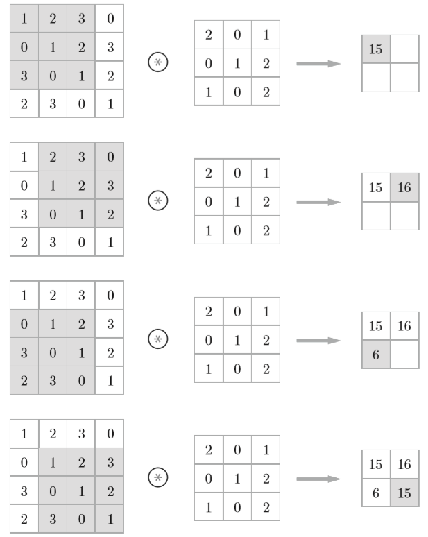
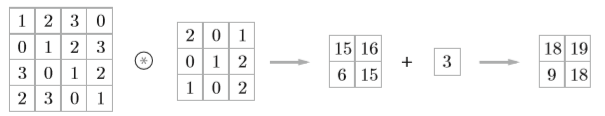
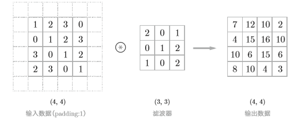
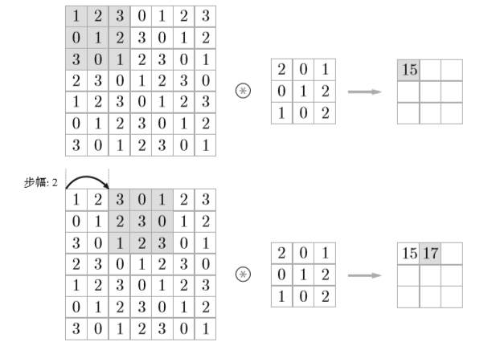
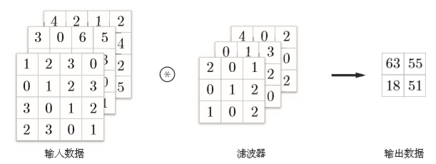
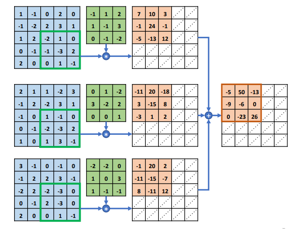
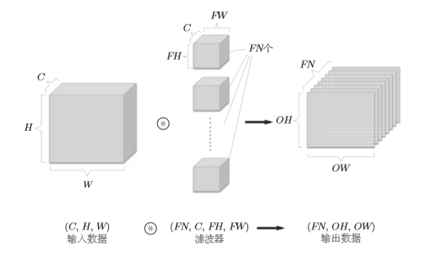
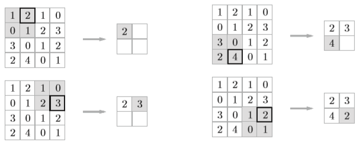
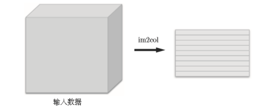
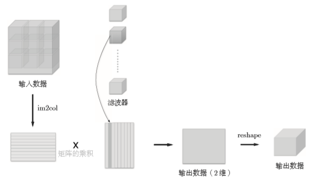

# NN入门，手把手教你用Numpy手撕NN(3)

**这是一篇包含极少数学的CNN入门文章**

上篇[文章](NN入门(2).md)中简单介绍了NN的反向传播，并利用反向传播实现了一个简单的NN，在这篇文章中将介绍一下CNN。

## CNN

CV（计算机视觉）作为AI的一大研究方向，越来越多的人选择了这个方向，其中使用的深度学习的方法基本以卷积神经网络（CNN）为基础。因此，这篇文章将介绍CNN的实现。

CNN与我们之前介绍的NN的相比，出现了卷积层(Convolution层)和池化层(Pooling层)。其网络架构大致如下图所示

### 卷积层

#### 与全连接神经网络的对比

为什么在有存在全连接神经网络的情况下还会出现卷积神经网络呢？

这就得来看看全连接神经网络存在的问题了，全连接神经网络中存在的问题是数据的形状被“忽略了”。比如，输入的数据是图像时，图像通常是高、长、通道方向上的3为形状。

但是，全连接层输入时，需要将3维数据拉平为1维数据，因此，我们可能会丢失图像数据中存在有的空间信息（如空间上临近像素为相似的值、RGB的各个通道之间的关联性、相距较远像素之间的关联性等），这些信息都会被全连接层丢失。

而卷积层可以保持形状不变，将输入的数据以相同的维度输出，因此，可能可以正确理解图像等具有形状的数据。

#### 卷积运算

卷积层进行的处理就是卷积运算，运算方式如下图所示




一般在计算中也会加上偏置



#### 填充

在进行卷积层的处理之前，有时要向输入数据的周围填入固定的数据（如0），称为填充(padding)。如下图所示



向输入数据的周围填入0，将大小为(4, 4)的输入数据变成了(6, 6)的形状。

**为什么要进行填充操作？**

在对大小为(4, 4)的输入数据使用(3, 3)的滤波器时，输出的大小会变成(2, 2)，如果反复进行多次卷积运算，在某个时刻输出大小就有可能变成1，导致无法再应用卷积运算。为了避免这种情况，就要使用填充，使得卷积运算可以在保持空间大小不变的情况下将数据传给下一层。

#### 步幅

应用滤波器的位置间隔称为步幅(stride)。在上面的例子中，步幅都为1，如果将步幅设为2，则如下图所示



*可以发现，增大步幅后，输出大小会变小，增大填充后，输出大小会变大。*

假设输入大小为(H, W)，滤波器大小为(FH, FW)，输出大小为(OH, OW)，填充为P，步幅为S，则输出大小可以表示为
$$
OH=\frac{H+2P-FH}{S}+1 \\
OW=\frac{W+2P-FW}{S}+1
$$

#### 三维数据卷积运算

上面卷积运算的例子都是二维的数据，但是，一般来说我们的图像数据都是三维的，除了高、宽之外，还需要处理通道方向的数据。如下图所示



其计算方式为每个通道处的数据与对应通道的卷积核相乘，最后将各个通道得到的结果相加，从而得到输出。



**这里需要注意的是，一般情况下，卷积核的通道数需要与输入数据的通道数相同。（有时会使用1x1卷积核来对通道数进行降/升维操作）。**

上面给出的例子输出的结果还是一个通道的，如果我们想要输出的结果在通道上也有多个输出，该怎么做呢？如下图所示



即使用多个卷积核

### 池化层

池化是缩小高、长方向上的空间的运算。比如下图所示的最大池化



除了上图所示的Max池化之外，还有Average池化。一般来说，池化的窗口大小会和步幅设定成相同的值。

### im2col

从前面的例子来看，会发现，如果完全按照计算过程来写代码的话，要用上好几层for循环，这样的话不仅写起来麻烦，估计在运行的时候计算速度也很慢。这里将介绍im2col的方法。

im2col将输入数据展开以适合卷积核，如下图所示



对3维的输入数据应用im2col之后，数据转化维2维矩阵。

使用im2col展开输入数据后，之后就只需将卷积层的卷积核纵向展开为1列，并计算2个矩阵的乘积即可。这和全连接层的Affine层进行的处理基本相同。 



### 代码实现

讲了这么多，这里将给出代码实现

```python
import numpy as np

def im2col(input_data, filter_h, filter_w, stride=1, pad=0):
    """
    input_data : 由（数据量，通道，高，长）的4维数组构成的输入数据 
    filter_h : 滤波器的高 
    filter_w : 滤波器的长 
    stride : 步幅 
    pad : 填充
    """
    N, C, H, W = input_data.shape
    out_h = (H + 2*pad - filter_h)//stride + 1
    out_w = (W + 2*pad - filter_w)//stride + 1

    img = np.pad(input_data, [(0,0), (0,0), (pad, pad), (pad, pad)], 'constant')
    col = np.zeros((N, C, filter_h, filter_w, out_h, out_w))

    for y in range(filter_h):
        y_max = y + stride*out_h
        for x in range(filter_w):
            x_max = x + stride*out_w
            col[:, :, y, x, :, :] = img[:, :, y:y_max:stride, x:x_max:stride]

    col = col.transpose(0, 4, 5, 1, 2, 3).reshape(N*out_h*out_w, -1)
    return col

def col2im(col, input_shape, filter_h, filter_w, stride=1, pad=0):
    N, C, H, W = input_shape
    out_h = (H + 2*pad - filter_h)//stride + 1
    out_w = (W + 2*pad - filter_w)//stride + 1
    col = col.reshape(N, out_h, out_w, C, filter_h, filter_w).transpose(0, 3, 4, 5, 1, 2)

    img = np.zeros((N, C, H + 2*pad + stride - 1, W + 2*pad + stride - 1))
    for y in range(filter_h):
        y_max = y + stride*out_h
        for x in range(filter_w):
            x_max = x + stride*out_w
            img[:, :, y:y_max:stride, x:x_max:stride] += col[:, :, y, x, :, :]

    return img[:, :, pad:H + pad, pad:W + pad]


class Convolution:
    def __init__(self, W, b, stride=1, pad=0):
        self.W = W
        self.b = b
        self.stride = stride
        self.pad = pad

        self.x = None
        self.col = None
        self.col_W = None

        self.dW = None
        self.db = None
    
    def forward(self, x):
        # [N, C, H, W]
        FN, C, FH, FW = self.W.shape
        N, C, H, W = x.shape
        out_h = int(1 + (H + 2 * self.pad - FH) / self.stride)
        out_w = int(1 + (W + 2 * self.pad - FW) / self.stride)

        col = im2col(x, FH, FW, self.stride, self.pad)
        col_W = self.W.reshape(FN, -1).T # 滤波器展开
        out = np.dot(col, col_W) + self.b

        out = out.reshape(N, out_h, out_w, -1).transpose(0, 3, 1, 2)

        self.x = x
        self.col = col
        self.col_W = col_W

        return out
    
    def backward(self, dout):
        FN, C, FH, FW = self.W.shape
        dout = dout.transpose(0, 2, 3, 1).reshape(-1, FN)

        self.db = np.sum(dout, axis=0)
        self.dW = np.dot(self.col.T, dout)
        self.dW = self.dW.transpose(1, 0).reshape(FN, C, FH, FW)

        dcol = np.dot(dout, self.col_W.T)
        dx = col2im(dcol, self.x.shape, FH, FW, self.stride, self.pad)

        return dx

class Pooling:
    def __init__(self, pool_h, pool_w, stride=1, pad=0):
        self.pool_h = pool_h
        self.pool_w = pool_w
        self.stride = stride
        self.pad = pad

        self.x = None
        self.arg_max = None

    def forward(self, x):
        N, C, H, W = x.shape
        out_h = int(1 + (H - self.pool_h) / self.stride)
        out_w = int(1 + (W - self.pool_w) / self.stride)

        col = im2col(x, self.pool_h, self.pool_w, self.stride, self.pad)
        col = col.reshape(-1, self.pool_h*self.pool_w)

        arg_max = np.argmax(col, axis=1)
        out = np.max(col, axis=1)
        out = out.reshape(N, out_h, out_w, -1).transpose(0, 3, 1, 2)

        self.x = x
        self.arg_max = arg_max

        return out

    def backward(self, dout):
        dout = dout.transpose(0, 2, 3, 1)

        pool_size = self.pool_h * self.pool_w
        dmax = np.zeros((dout.size, pool_size))
        dmax[np.arange(self.arg_max.size), self.arg_max.flatten()] = dout.flatten()
        dmax = dmax.reshape(dout.shape + (pool_size,)) 
        
        dcol = dmax.reshape(dmax.shape[0] * dmax.shape[1] * dmax.shape[2], -1)
        dx = col2im(dcol, self.x.shape, self.pool_h, self.pool_w, self.stride, self.pad)
        
        return dx


```

## 小节

这篇文章断断续续地写了好久，中间还顺便在学tensorflow 2.0 ，还是框架用的舒服 orz。。。这几天还是决定把这篇文章写完，坑挖了还是得填，numpy手撕NN系列也算是暂时完成了，RNN后面再考虑。。。这之后准备再补补一些学过的算法的总结以及前段时间看的一些论文的总结。


