# 学机器学习，不会数据分析怎么行——数据可视化分析
## 前言

前面两篇文章介绍了 python 中两大模块 pandas 和 numpy 的一些基本使用方法，然而，仅仅会处理数据还是不够的，我们需要学会怎么分析，毫无疑问，利用图表对数据进行分析是最容易的，通过图表可以很好地理解数据之间的关联性以及某些数据的变化趋势。因此，将在这篇博客中介绍 python 中可视化工具 matplotlib 的使用。

## Figure 和 Subplot
matplotlib 的图像都位于 Figure 对象中，可以用 `plt.figure` 创建一个新的 Figure

```python
fig = plt.figure()
```

`plt.figure` 有一些选项，如 figsize(用于设置图片大小)。不能通过空 Figure 绘图，必须用 `add_subplot` 创建一个或多个 subplot 才行

```python
ax1 = fig.add_subplot(2,2,1) # 2*2 的图像，选中的是4个subplot中的第一个
ax2 = fig.add_subplot(2,2,2)
ax3 = fig.add_subplot(2,2,3)
```

最终得到的图如下所示
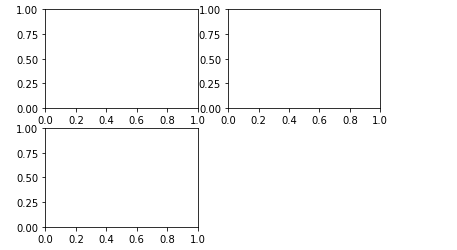

画三张图

```python
ax3.plot(np.random.randn(50).cumsum(),'k--') # k--表示线型
_ = ax1.hist(np.random.randn(100),bins=20,color='k',alpha=0.3)
ax2.scatter(np.arange(30),np.arange(30)+3*np.random.randn(30))
```

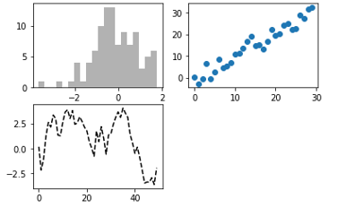

上图中只是三种图表类型，你可以在matplotlib的文档中找到各种图表类型。由于根据特定布局创建Figure和subplot是一件非常常见的任务，于是便出现了一个更为方便的方法 `plt.subplots` ，它可以创建一个新的Figure，并返回一个含有已创建的subplot对象的NumPy数组

```python
fig, axes = plt.subplots(2,3)
axes
```

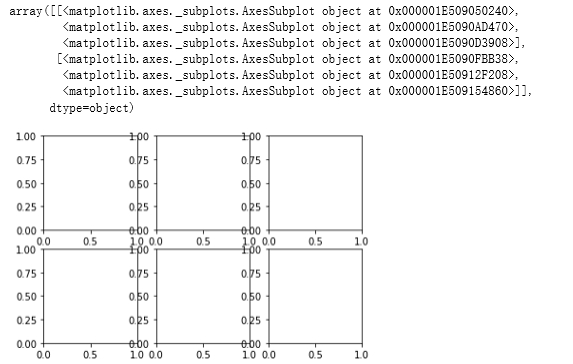


这种方法非常的实用，我们可以轻松对axes数据进行索引。我们还可以通过 `sharex` 和 `sharey` 指定 subplot 应该具有的X轴和Y轴。在比较相同范围的数据时，这也是非常实用的，否则，matplotlib 会自动缩放各图表的界限。

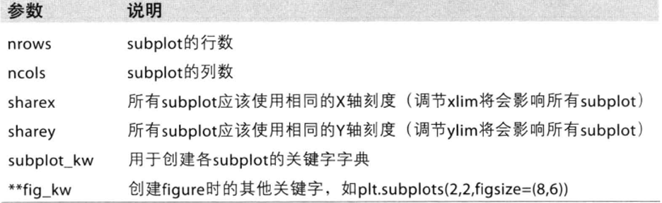

## 图表各要素
下面在介绍介绍如何添加图表的各个要素  
### 标题、轴标签、刻度以及刻度标签
要修改X轴的刻度，最简单的方法是使用set_xticks和set_xticklabels。前者告诉matplotlib要将刻度放在数据范围中的哪些位置，默认情况下，这些位置也就是刻度标签。但我们可以通过set_xticklabels将任何其他的值作用于标签

```python
# 绘制一段随机漫步
fig = plt.figure()
ax = fig.add_subplot(1,1,1)
ax.plot(np.random.randn(1000).cumsum())
```

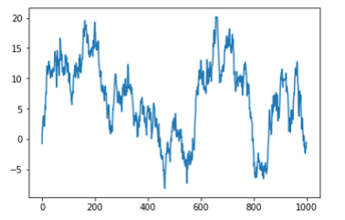

```python
ticks = ax.set_xticks([0,250,500,750,1000])
labels = ax.set_xticklabels(['one','two','three','four','five'])
ax.set_title('My first matplotlib plot')
ax.set_xlabel('stages')
```

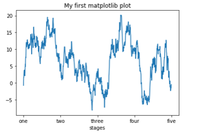

### 图例

```python
ax.plot(np.random.randn(1000).cumsum(),label = 'one')
ax.plot(np.random.randn(1000).cumsum(),'k--',label='two')
ax.plot(np.random.randn(1000).cumsum(),'k.',label='three')
ax.legend(loc='best') # loc 告诉matplotlib要将图例放在哪	
```
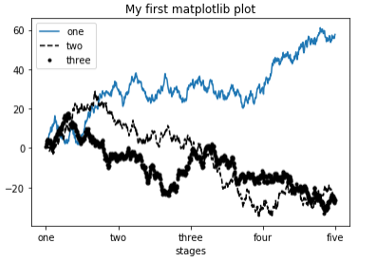

### 注释
除标准的图标对象之外，你可能还希望绘制一些自定以的注解（比如文本、箭头或其他图形等）  
注解可以通过 `text`, `arrow`和`annotate`等函数进行添加。`text`可以将文本绘制在图表的指定坐标 $(x,y)​$ ，还可以加上一些自定以格式

```python
ax.text(x,y,'Hello World!', family='monospace', fontsize=10, verticalalignment="top", horizontalalignment="right")
```

x,y:表示坐标值上的值  
string:表示说明文字  
fontsize:表示字体大小  
verticalalignment：垂直对齐方式 ，参数：[ ‘center’ | ‘top’ | ‘bottom’ | ‘baseline’ ]  
horizontalalignment：水平对齐方式 ，参数：[ ‘center’ | ‘right’ | ‘left’ ]  


```python
x1 = np.random.normal(30, 3, 100)
x2 = np.random.normal(20, 2, 100)

plt.plot(x1, label = 'plot')
plt.plot(x2, label = '2nd plot')
plt.legend(bbox_to_anchor=(0., 1.02, 1., .102), loc=2,
           ncol=2, mode='expand', borderaxespad=0.)
plt.annotate('Important value', (55,20),
             xycoords='data',
             xytext=(5,38),
             arrowprops = dict(arrowstyle = '->'))

plt.show()
```

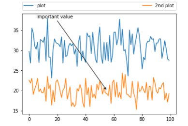

annotate(s='str' ,xy=(x,y) ,xytext=(l1,l2) ,..)

s 为注释文本内容   
xy 为被注释的坐标点  
xytext 为注释文字的坐标位置  
xycoords 参数如下:  

+ figure points          points from the lower left of the figure 点在图左下方
- figure pixels          pixels from the lower left of the figure 图左下角的像素
+ figure fraction       fraction of figure from lower left 左下角数字部分axes 
- points           points from lower left corner of axes 从左下角点的坐标axes 
+ pixels           pixels from lower left corner of axes 从左下角的像素坐标
- axes fraction        fraction of axes from lower left 左下角部分
+ data                     use the coordinate system of the object being annotated(default) 使用的坐标系统被注释的对象（默认）
- polar(theta,r)       if not native ‘data’ coordinates t

`extcoords` 设置注释文字偏移量

参数 | 坐标系 
:---: | :---: 
'figure points' | 距离图形左下角的点数量 
'figure pixels' | 距离图形左下角的像素数量 
'figure fraction' | 0,0 是图形左下角，1,1 是右上角 
'axes points' | 距离轴域左下角的点数量 
'axes pixels' | 距离轴域左下角的像素数量 
'axes fraction' | 0,0 是轴域左下角，1,1 是右上角 
'data' | 使用轴域数据坐标系 


`arrowprops`  #箭头参数,参数类型为字典dict

+ width           the width of the arrow in points                              点箭头的宽度
+ headwidth   the width of the base of the arrow head in points  在点的箭头底座的宽度
+ headlength  the length of the arrow head in points                   点箭头的长度
+ shrink          fraction of total length to ‘shrink’ from both ends  总长度为分数“缩水”从两端
+ facecolor     箭头颜色

bbox给标题增加外框 ，常用参数如下：
+ boxstyle方框外形  
+ facecolor(简写fc)背景颜色  
+ edgecolor(简写ec)边框线条颜色  
+ edgewidth边框线条大小


```python
bbox=dict(boxstyle='round,pad=0.5', fc='yellow', ec='k',lw=1 ,alpha=0.5)  #fc为facecolor,ec为edgecolor,lw为lineweight
```

## pandas中的绘图函数
我们平时基本都是使用pandas处理数据，所以，能够利用pandas中内置的plot来画图会方便许多，下面将介绍几种常用图表的画法
### 线型图
Series 和 DataFrame 都有一个用于生成各类图表的plot方法。默认情况下为线型图

```python
s = pd.Series(np.random.randn(10).cumsum(),index=np.arange(0,100,10))
s.plot()
```

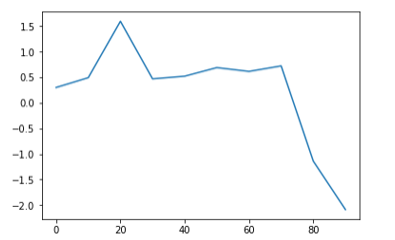

该Series对象的索引会被传给matplotlib，并用以绘制X轴。可以通过use_index=False禁用该功能。X轴的刻度和界限可以通过xticks和xlim选项进行调节，Y轴就用yticks和ylim。  
DataFrame的plot方法会在一个subplot中为各列绘制一条线，并自动创建图例

```python
df = pd.DataFrame(np.random.randn(10,4).cumsum(0),columns=['A','B','C','D'],index=np.arange(0,100,10))
df.plot()
```

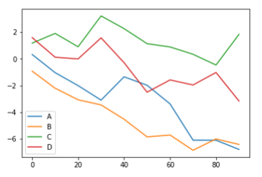

Series.plot参数如下：
+ label 	用于图例标签
+ ax 	要在其上进行绘制的matplotlib subplot对象。
+ style 	将要传给matplotlib的风格字符串（如'ko--'）
+ alpha 	图表的填充不透明度(0-1)
+ kind 	可以是'line' 'bar' 'barch' 'kde'
+ logy 	在Y轴上是同对数标尺
+ use_index 	将对象的索引用作刻度标签
+ rot 	旋转刻度标签(0-360)
+ xticks 	用作X轴刻度的值
+ yticks 	用作Y轴刻度的值
+ xlim 	X轴的界限
+ ylim	Y轴的界限
+ grid 	显示轴网格线（默认打开）

专用于DataFrame的plot参数：
+ subplots 	将各个DataFrame列绘制到单独的subplot中
+ sharex 	如果subplots=True，则共用同一个X轴，包括刻度和界限
+ sharey 	如果subplots=True，则共用同一个Y轴
+ figsize 	表示图像大小的元组
+ title 	表示图像标题的字符串
+ legend 	添加一个subplot图例
+ sort_columns 	以字母表示顺序绘制各列，默认使用当前列顺序
*注：有关时间序列的处理这篇博客中暂时不写，将在后续博客中补充*

### 柱状图
在生成线型图的代码中加上kind='bar'或kind='barh'即可生成柱状图。这时，Series和DataFrame的索引将会被用作X或Y刻度

```python
fig, axes = plt.subplots(2,1)
data = pd.Series(np.random.rand(16),index=list('abcdefghijklmnop'))
data.plot(kind='bar',ax=axes[0],color='k',alpha=0.8,figsize=(8,10))
data.plot(kind='barh',ax=axes[1],color='k',alpha=0.8,figsize=(8,10))
```

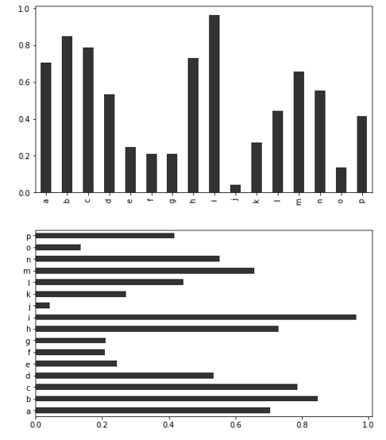

```python
df = pd.DataFrame(np.random.rand(6,4),index=['one','two','three','four','five','six'],columns=pd.Index(['A','B','C','D'],name='Genus'))
df
```

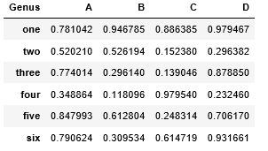

```python
df.plot(kind='bar')
```

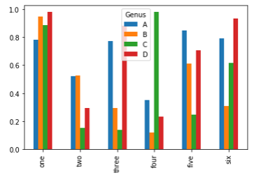

```python
df.plot(kind='barh',stacked=True) # 设置stacked为True生成堆叠图
```

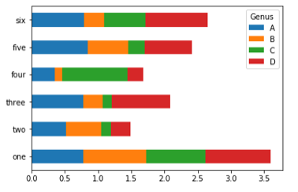

*注：柱状图可以利用value_counts图形化显示Series中各值出现的频率*

```python
df.div(df.sum(1).astype(float),axis=0).plot(kind='barh',stacked=True)
```

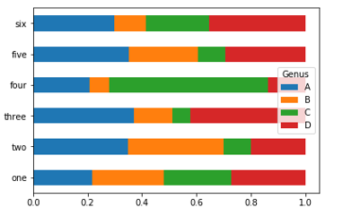

### 直方图和密度图
直方图是一种可以对值频率进行离散化显示的柱状图，。数据点被拆分到离散的、间隔均匀的面元中，绘制的时各面元中数据点的数量。

```python
length = pd.DataFrame({'length': [10, 20,15,10,1,12,12,12,13,13,13,14,14,14,41,41,41,41,41,4,4,4,4]})
length.plot.hist()
```

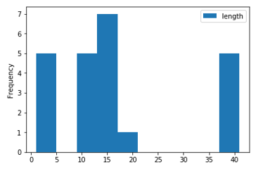

与直方图相关的一种图表类型时密度图，它是通过计算“可能会产生观测数据的连续概率分布的估计”而产生的。一般的过程是将该分布近似为一组核（即诸如正态（高斯）分布之类的较为简单的分布）。因此，密度图也被称作KDE图，调用plot时加上kind='kde'即可生成一张密度图（标准混合正态分布）。

	length.plot(kind='kde')


```python
df4 = pd.DataFrame({'a': np.random.randn(1000) + 1, 'b': np.random.randn(1000), 'c': np.random.randn(1000) - 1}, index=range(1,1001), columns=['a', 'b', 'c'])  #bins=20表示数值分辨率，具体来说是将随机数设定一个范围，例如5.6，5.7，6.5，如果数值分辨率越低，则会将三个数分到5-7之间，如果数值分辨率越高，则会将5.6，5.7分到5-6之间，而6.5分到6-7之间；值越小表示分辨率越低，值越大表示分辨率越高；
df4.plot.hist(stacked=True, bins=20, alpha=0.5)
```

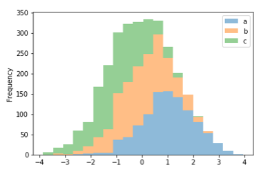

```python
df4.diff().hist(color='k', alpha=0.5, bins=50) #可将DataFrame当中column分开
```

这两种图表常常会被画在一起。直方图以规格化形式给出（以便给出面元化密度），然后再在其上绘制核密度估计。

	comp1 = np.random.normal(0,1,size=200)
	comp2 = np.random.normal(10,2,size=200)
	values = pd.Series(np.concatenate([comp1,comp2]))
	values.hist(bins=100,alpha=0.3,color='k',normed=True)
	values.plot(kind='kde')

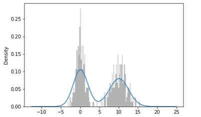

### 散点图
散点图（scatter plot）是观察两个一维数据序列之间的关系的有效手段。matplotlib的scatter方法是绘制散点图的主要方法。

	df = pd.DataFrame(np.random.rand(50, 4), columns=['a', 'b', 'c', 'd'])
	df.plot.scatter(x='a', y='b') # 以a列为X轴数值，b列为Y轴数值绘制散点图

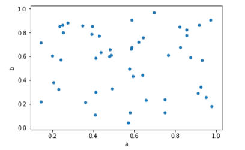

如果想将不同的散点图信息绘制到一张图片当中，需要利用不同的颜色和标签进行区分

	ax = df.plot.scatter(x='a', y='b', color='Blue', label='Group 1')
	df.plot.scatter(x='c', y='d', color='Green', label='Group 2', ax=ax)

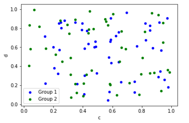

在探索式数据分析（EDA）工作中，同时观察一组变量的散点图是很有意义的，这也被称为散点图矩阵。

	from sklearn.datasets import load_iris # 使用sklearn库里的iris数据集
	iris_dataset = load_iris()
	from sklearn.model_selection import train_test_split
	X_train,X_test,y_train,y_test = train_test_split(iris_dataset['data'],iris_dataset['target'],random_state=0)
	iris_dataframe=pd.DataFrame(X_train,columns=iris_dataset.feature_names)
	grr = pd.plotting.scatter_matrix(iris_dataframe,marker='o',c = y_train,hist_kwds={'bins':20},figsize=(12,10))

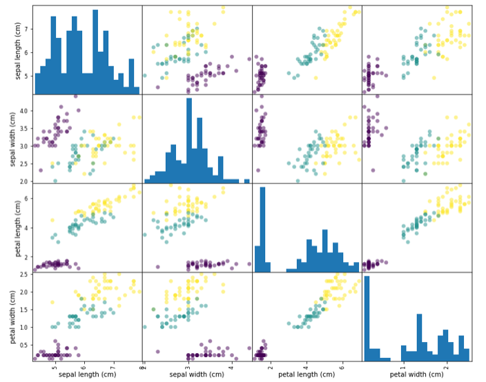

### 饼图
饼图展现的是百分比关系

	series = pd.Series(4 * np.random.rand(4), index=['a', 'b', 'c', 'd'], name='series')
	series.plot.pie(figsize=(6, 6))

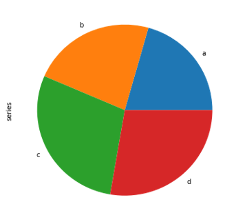

对于DataFrame对象，每一个column都可独立绘制一张饼图，但需要利用subplots=True参数将，每个饼图绘制到同一张图中。 
	df = pd.DataFrame(3 * np.random.rand(4, 2), index=['a', 'b', 'c', 'd'], columns=['x', 'y'])
	df.plot.pie(subplots=True, figsize=(8, 4))

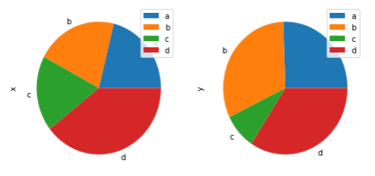

*由于箱型图接触不多，涉及内容较多且较为重要，后面会另写一篇关于箱型图的博客*

### 各种绘图方式对于缺失值的处理
Missing values are dropped, left out, or filled depending on the plot type 
 图表|处理方式 
:--: |:--:
Plot Type | NaN Handling 
Line | Leave gaps at NaNs 
Line (stacked) | Fill 0’s 
Bar | Fill 0’s 
Scatter | Drop NaNs 
Histogram | Drop NaNs (column-wise) 
Box | Drop NaNs (column-wise) 
Area | Fill 0’s 
KDE | Drop NaNs (column-wise) 
Hexbin | Drop NaNs 
Pie | Fill 0’s 


## 总结
上面是一些常用图的画法介绍，当然，我们还有很多可画的图如箱型图、区域面积图、等高线图等等，也能利用 matplotlib 来绘制地图，当然这些在这就暂时先不介绍了，以后需要了再一一补充。


## 参考
《利用python进行数据分析》第八章
https://blog.csdn.net/wangxingfan316/article/details/80033557
https://blog.csdn.net/genome_denovo/article/details/78322628
https://blog.csdn.net/Notzuonotdied/article/details/77876080
