# 基本概念

`支持向量机`（support vector machines，SVM）是一种`二分类`模型，它的基本模型是定义在特征空间上的`间隔最大`的线性分类器。支持向量机还包括`核技巧`，这使它成为实质上的非线性分类器。其学习策略就是间隔最大化，可形式化为一个求解凸二次规划（convex quadratic programming）的问题，也等价于正则化的合页损失函数的最小化问题，支持向量机的学习算法是求解凸二次规划的`最优化`算法。

支持向量机学习方法包含构建由简至繁的模型：`线性可分支持向量机`（linear support vector machine in linearly separable case）、`线性支持向量机`（linear support vector machine）及`非线性支持向量机`（non-linear support vector machine）。当训练数据线性可分时，通过`硬间隔最大化`（hard margin maximization），学习一个线性的分类器；当训练数据近似线性可分时，通过`软间隔最大化`（soft margin maximization），也学习一个线性的分类器；当训练数据不可分时，通过`核技巧`（kernel trick）及软间隔最大化，训练非线性的分类器。

# 最大边缘超平面

对于一个二分类问题，若数据集是线性可分的，那么我们可以找到这样一个超平面，使得数据的两个label分别位于平面两侧。并且，可以注意到，这样的超平面我们可以找到无数个。

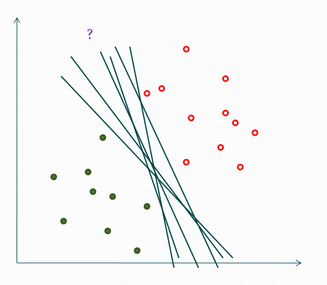

然而，虽然有无数个这样的超平面，我们并不能保证这些超平面在未知实例上的效果都一样的好。因此，我们需要找到一个具有很好的泛化误差的超平面。这里，我们可以选取`最大边缘超平面`。下面将讲述原因。

## 函数间隔

下图中有A，B，C三点，表示3个实例，对于这3个实例的预测，我们预测的确信度会是A>B>C这样一个结果。一般来说，一个点距离超平面的远近可以表示分类预测的确信程度。在超平面 $w \cdot x+b=0​$ 确定的情况下， $|w \cdot x +b|​$ 能够相对地表示点 $x​$ 距离超平面地远近。而 $w \cdot x + b​$ 的符号与类似标记 $y​$ 的符号是否一致能够表示分类是否正确。所以可用量 $y(w \cdot x + b)​$ 来表示分类的正确性及确信度，这就是函数间隔（function margin）。

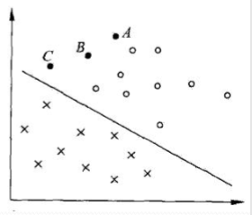

## 几何间隔

函数间隔可以表示分类预测的正确性及确信度，但是选择分离超平面时，只有函数间隔还不够，因为只要成比例地该边$w和b​$，超平面并没有改变，但函数间隔却变为原来地两倍。因此，我们需要对分离超平面的法向量 $w​$ 加某些约数，如规范化。这时，函数间隔便成了几何间隔（geometric margin）。

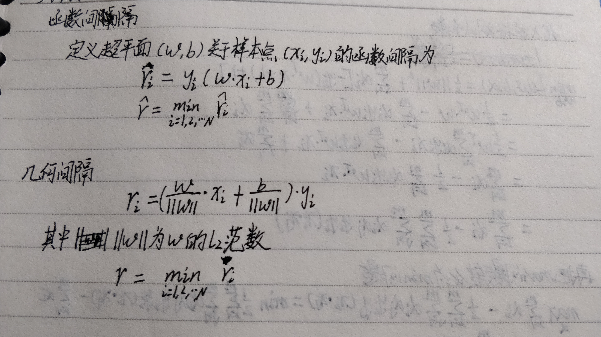

## 间隔最大化

对训练数据集找到几何间隔最大的超平面意味着以充分大的确信度对训练数据进行分类。即，不仅将正负实例点分开，而且对最难分的实例点也有足够大的确信度将它们分开，这样的超平面对未知的新实例有很好的分类预测能力。这也是为什么我们要选取最大边缘超平面的原因。

# 线性可分支持向量机

## 最大间隔法

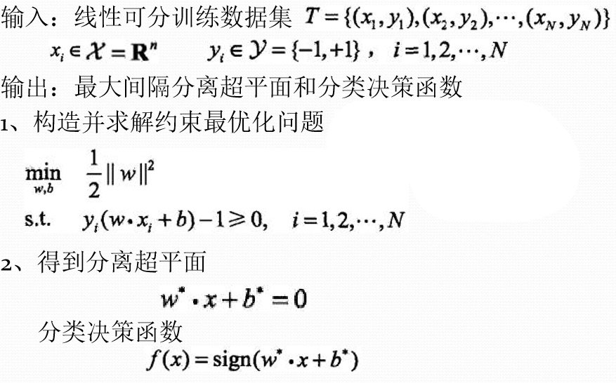

## 最优化

运用拉格朗日对偶性，通过求解对偶问题（dual problem）得到原始问题的最优解。

优点：

 	1. 对偶问题往往更易求解
 	2. 自然引入核函数，进而推广到非线性分类问题

首先构建拉格朗日函数，对每个不等式约束引进拉格朗日乘子 $\alpha_i \ge 0,i=1,2, \cdots,N​$ ,定义拉格朗日函数：
$$
L(w,b,\alpha)=\frac{1}{2}||w||^2-\sum_{i=1}^{N}\alpha_iy_i(w\cdot x_i+b)+\sum_{i=1}^{N}\alpha_i
$$
其中，$\alpha =(\alpha_1,\alpha_2, \cdots ,\alpha_N)^T​$ 为拉格朗日乘子向量。

根据拉格朗日对偶性，原始问题的对偶问题就是极大极小问题：
$$
\max_a\min_{w,b}L(w,b,a)
$$
附上推导过程

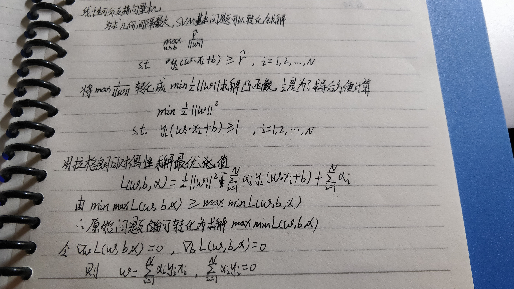

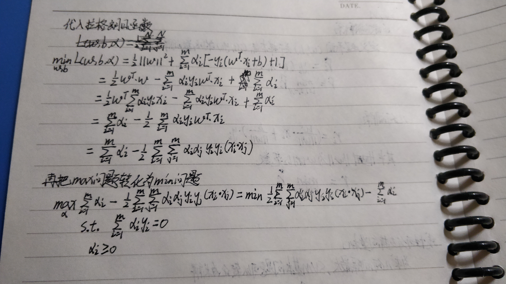

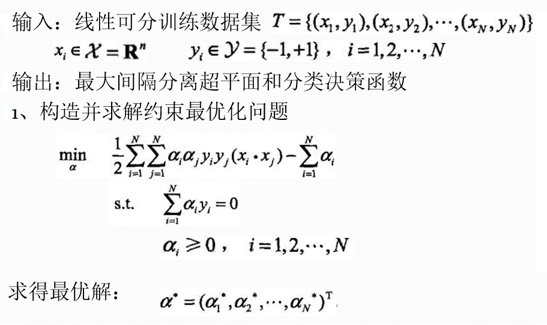

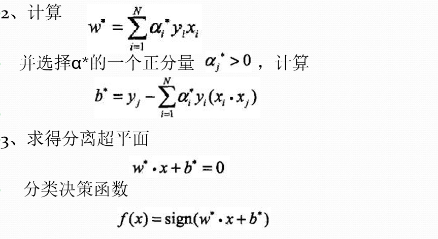

# 线性支持向量机

当数据集无法线性可分时，如下图所示

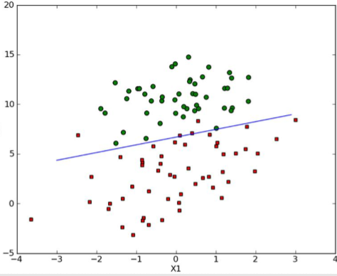

这时，我们可以对每一个样本点引进一个松弛变量 $\zeta_i \ge 0  ​$ ，使函数间隔加上松弛变量大于等于1，这样，约束条件就变成
$$
y_i(w \cdot x+b)\ge 1-\zeta_i
$$
同时，对每个松弛变量 $ \zeta_i ​$ ，支付一个代价 $\zeta_i  ​$ 。目标函数由原来的$\frac{1}{2}||w||^2​$ 变成
$$
\frac{1}{2}||w||^2+C\sum_{i=1}^{N}\zeta_i
$$
这里，$ C > 0  ​$ 称为惩罚参数，一般由应用问题决定。最小化目标函数包含两层含义：使 $ \frac{1}{2}||w||^2 ​$ 尽量小，即间隔尽量大，同时使误差分类点的个数尽量小，C是调和二者的系数。

同上述推导方法，我们可写出下面算法

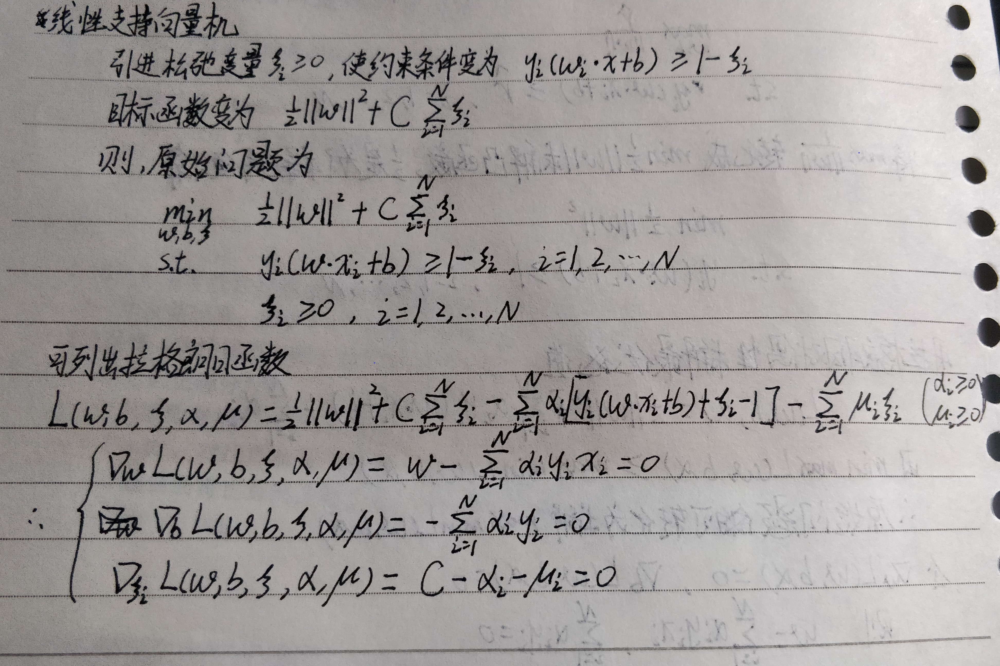

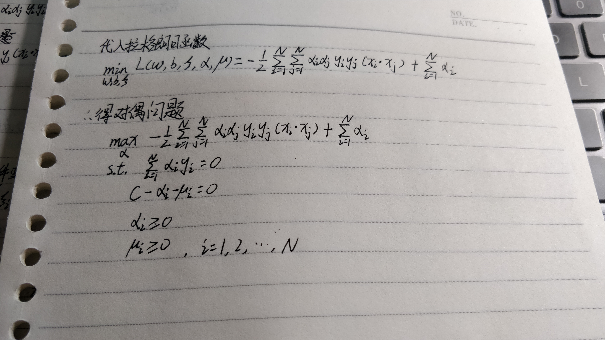

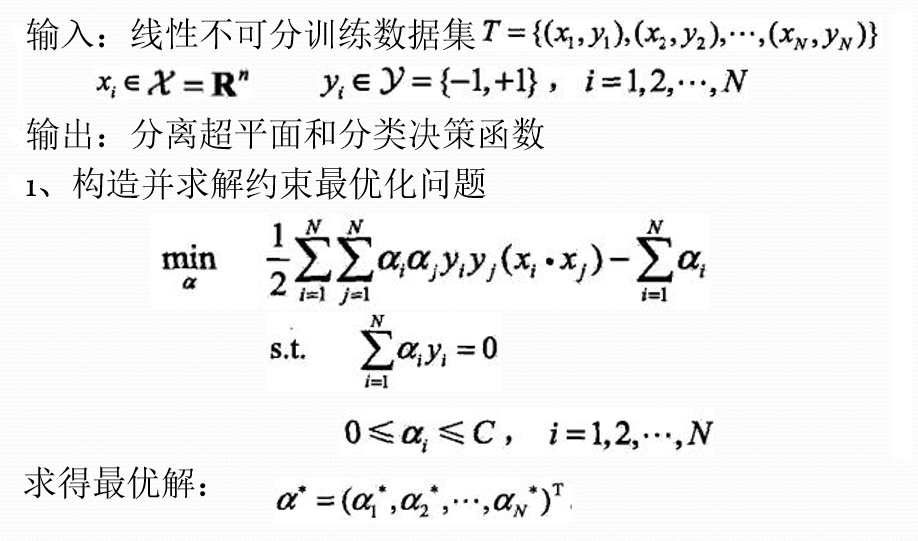

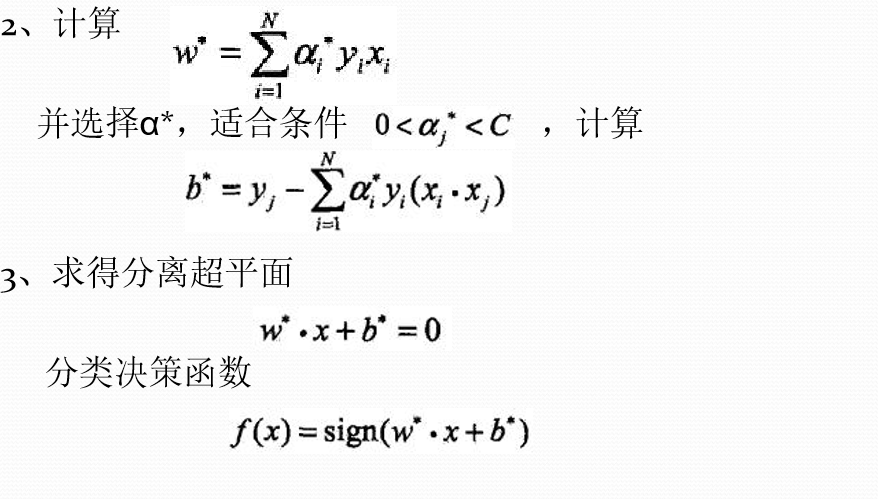

# 非线性支持向量机

有时，我们面对的是非线性问题，如下图左。非线性问题往往不好求解，所以希望能用解线性分类问题的方法解决这个问题，采取的方法是进行一个非线性变换，将非线性问题变换为线性问题，通过解变换后的线性问题的方法求解原来的非线性问题。

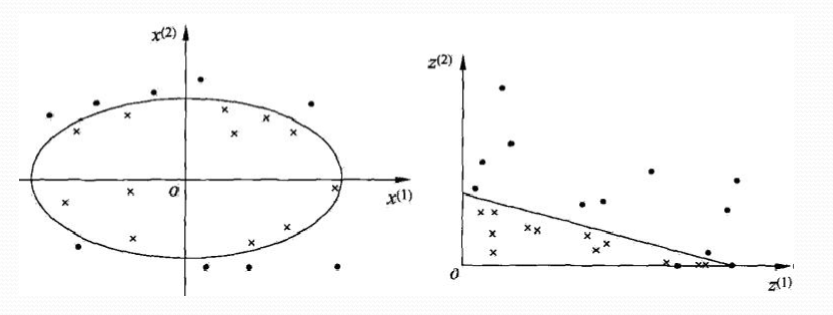

原空间：
$$
\mathcal{X} \subset \mathbf{R}^{2}, x=\left(x^{(1)}, x^{(2)}\right)^{\mathrm{T}} \in \mathcal{X}
$$
新空间：
$$
\mathcal{Z} \subset \mathbf{R}^{2}, z=\left(z^{(1)}, z^{(2)}\right)^{\mathrm{T}} \in \mathcal{Z} \quad z=\phi(x)=\left(\left(x^{(1)}\right)^{2},\left(x^{(2)}\right)^{2}\right)^{\mathrm{T}}
$$

## 核函数

设 $\mathcal{X}​$ 是输入空间(欧氏空间 $\mathbf{R}^{n}​$ 的子集或离散集合)，又设 $\mathcal{H}​$ 为特征空间(希尔伯特空间)，如果存在一个从 $\mathcal{X}​$ 到 $\mathcal{H}​$ 的映射
$$
\phi(x) : \mathcal{X} \rightarrow \mathcal{H}
$$
使得对所有
$$
x, z \in \mathcal{X}
$$
函数K(x,z)满足条件
$$
K(x, z)=\phi(x) \cdot \phi(z)
$$
则称 K(x,z) 为核函数， $\phi(x) ​$ 为映射函数， 式中 $\phi(x) \cdot \phi(z)​$ 为  $\phi(x) ​$  和 $\phi(z)​$ 的内积。

在学习与预测中只定义核函数K(x,z)，而不显式地定义映射函数，通常，直接计算K(x,z)比较容易，而通过 $\phi(x) ​$  和 $\phi(z)​$ 计算K(x, z)并不容易。

*注：φ是输入空间 $\mathbf{R}^{n}​$ 到特征空间 $\mathcal{H}​$ 的映射，特征空间  $\mathcal{H}​$ 一般是高维，映射可以不同。*

引入核函数后，目标函数改为
$$
W(\alpha)=\frac{1}{2} \sum_{i=1}^{N} \sum_{j=1}^{N} \alpha_{i} \alpha_{j} y_{i} y_{j} K\left(x_{i}, x_{j}\right)-\sum_{i=1}^{N} \alpha_{i}
$$

## 正定核

水平有限，不会推导，就直接给结论好了。。orz

通常我们所说的核函数就是正定核函数，设 $\mathrm{K} : \mathcal{X} \times \mathcal{X} \rightarrow \mathbf{R}​$  是对称函数，则K(x,z)为正定核函数 的充要条件是对任意 $x_{i} \in \mathcal{X}, \quad i=1,2, \cdots, m​$  ，K(x,z)对应的Gram矩阵
$$
K=\left[K\left(x_{i}, x_{j}\right)\right]_{m \times m}
$$
是半正定的。

这一定义在构造核函数时很有用。但对于一个具体函数 K(x,z) 来说，检验它是否为正定核函数并不容易，因为 要求对任意有限输入集 $\left\{x_{1}, x_{2}, \cdots, x_{m}\right\}​$ 验证K对应的 Gram矩阵是否为半正定的。在实际问题中往往应用己有的核函数。

## 常用核函数

+ 多项式核函数（Polynomial kernel function)

$$
K(x, z)=(x \cdot z+1)^{p}
$$

​	对应的支持向量机为P次多项式分类器，分类决策函数：
$$
f(x)=\operatorname{sign}\left(\sum_{i=1}^{N_{s}} a_{i}^{*} y_{i}\left(x_{i} \cdot x+1\right)^{p}+b^{*}\right)
$$

+ 高斯核函数 （Gaussian Kernel Function)

$$
K(x, z)=\exp \left(-\frac{\|x-z\|^{2}}{2 \sigma^{2}}\right)
$$

​	决策函数：
$$
f(x)=\operatorname{sign}\left(\sum_{i=1}^{N_{s}} a_{i}^{*} y_{i} \exp \left(-\frac{\|x-z\|^{2}}{2 \sigma^{2}}\right)+b^{*}\right)
$$

+ 字符串核函数（string kernel function）：

核函数不仅可以定义在欧式空间上，还可以定义在离散数据的集合上。比如，字符串核是定义在字符串集合上的核函数。字符串核函数在文本分类、信息检索、生物信息学等方面都有应用。
$$
k_n(s,t)=\sum_{u\in \sum^n}[\phi_n(s)]_u[\phi_n(t)]_u=\sum_{u\in \sum^n}\sum_{(i,j):s(i)=t(j)=u}\lambda^{l(i)}\lambda^{l(j)}
$$


字符串核函数 $k_n(s,t)​$ 给出了字符串s和t中长度等于n的所有字串组成的特征向量的余弦相似度。

## 算法

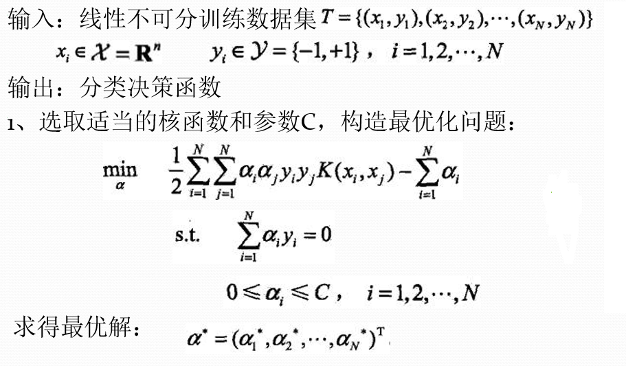

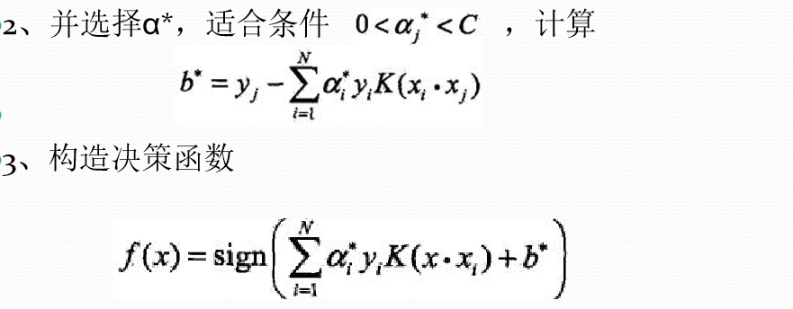

# 序列最小优化（SMO）算法

## 基本思路 

​	如果所有变量的解都满足此最优化问题的KKT条件，那么得到解； 否则，选择两个变量，固定其它变量，针对这两个变量构建一个二次规划问题，称为子问题，可通过解析方法求解，提高计算速度。

子问题的两个变量：一个是违反KKT条件最严重的那个，另 一个由约束条件自动确定。假设 $\alpha_1,\alpha_2​$ 为两个变量， $\alpha_3,\alpha_4, \cdots , \alpha_ N​$ 固定，那么由等式约束可知
$$
\alpha_1=-y_1\sum_{i=2}^{N}\alpha_iy_i
$$

## 变量选择

SMO算法在每个子问题中选择两个变量优化，其中至少一个变量是违反KKT条件的。

1. 第一个变量的选择：外循环，违反KKT最严重的样本点，检验样本点是否满足KKT条件：

$$
\alpha_{i}=0 \Leftrightarrow y_{i} g\left(x_{i}\right) \geqslant 1 \\
\begin{aligned} 0<\alpha_{i} &<C \Leftrightarrow y_{i} g\left(x_{i}\right)=1 \\ \alpha_{i} &=C \Leftrightarrow y_{i} g\left(x_{i}\right) \leqslant 1 \\ g\left(x_{i}\right) &=\sum_{j=1}^{N} \alpha_{j} y_{j} K\left(x_{i}, x_{j}\right)+b \end{aligned}
$$


2. 第二个变量的检查:  内循环， 选择的标准是希望能使目标函数有足够大的变化，即对应 $|E_1-E_2|​$ 最大 ,如果内循环通过上述方法找到的点不能使目标函数有足够的下降，则：遍历间隔边界上的样本点，测试目标函数下降 ，如果下降不大，则遍历所有样本点 ，如果依然下降不大，则丢弃外循环点，重新选择。

3. 每次完成两个变量的优化后，重新计算 $b,E_i​$

## 算法

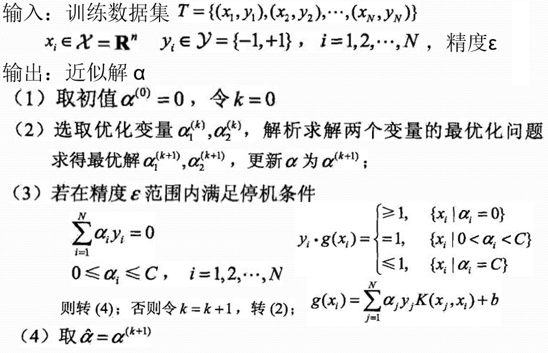

## 代码

这是我用的数据集数据的分布

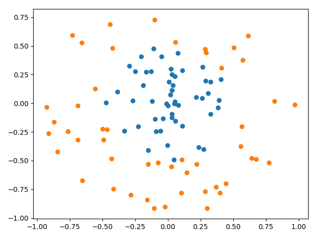

感觉还是看代码理解的快，先贴一份根据《机器学习实战》上写的代码

```python
import numpy as np
import pandas as pd
import matplotlib.pyplot as plt
import random
import math
from sklearn.model_selection import train_test_split
from sklearn.svm import SVC
"""
Author:
        ITryagain
Modify:
        2019-04-09
"""

def loadDataSet(fileName):
    """
    读取数据
    Parameters:
        fileName - 文件名
    Returns:
        dataMat - 数据矩阵
        labelMat - 数据标签
    """
    dataMat = []
    labelMat = []
    fr = open(fileName)
    for line in fr.readlines():  # 逐行读取，滤除空格等
        lineArr = line.strip().split('\t')
        dataMat.append([float(lineArr[0]), float(lineArr[1])])  # 添加数据
        labelMat.append(float(lineArr[2]))  # 添加标签
    return np.array(dataMat), np.array(labelMat)


class optStruct:
    def __init__(self, dataMatIn, classLabels, C, toler, kTup):
        """
        :param dataMatIn: 输入数据 [X1, X2, ... , XN]
        :param classLabels: 分类标签 [y]
        :param C: 松弛变量
        :param toler: 容错率
        """
        self.X = dataMatIn
        self.labelMat = classLabels
        self.C = C
        self.tol = toler
        self.m = np.shape(dataMatIn)[0]
        self.alphas = np.mat(np.zeros((self.m, 1)))
        self.b = 0
        self.eCache = np.mat(np.zeros((self.m, 2)))   # 误差缓存
        self.k = np.mat(np.zeros((self.m, self.m)))
        for i in range(self.m):
            self.k[:, i] = kernelTrans(self.X, self.X[i, :], kTup)


def calcEk(oS, k):
    """
    :param oS:
    :param k: 第k行
    :return: 预测值与实际值的差
    """
    fXk = float(np.multiply(oS.alphas, oS.labelMat).T * oS.k[:, k]) + oS.b
    Ek = fXk - float(oS.labelMat[k])
    return Ek

def clipAlpha(aj, H, L):
    """
    调整aj的值，使aj处于 L<=aj<=H
    :param aj: 目标值
    :param H: 最大值
    :param L: 最小值
    :return:
        aj 目标值
    """
    if aj > H:
        aj = H
    elif L > aj:
        aj = L
    return aj

def selectJrand(i, m):
    """
      随机选择一个整数
    :param i: 第一个alpha的下标
    :param m: 所有alpha的数目
    :return:
        j  返回一个不为i的随机数，在0~m之间的整数值
    """
    j = i
    while j == i:
        j = int(random.uniform(0, m))
    return j


def selectJ(i, oS, Ei):
    """
    内循环的启发式方法，选择第二个alpha的值
    :param i: 第一个alpha的下标
    :param oS:
    :param Ei: 预测结果与真实结果比对，计算误差Ei
    :return:
        j  随机选出的第j一行
        Ej 预测结果与真实结果比对，计算误差Ej
    """
    maxK = -1
    maxDeltaE = 0
    Ej = 0
    oS.eCache[i] = [1, Ei]  # 将输入值Ei在缓存中设置成为有效的。这里的有效意味着它已经计算好了。
    validEcacheList = np.nonzero(oS.eCache[:, 0].A)[0] # 非零E值的行的list列表，所对应的alpha值
    if(len(validEcacheList)) > 1:
        for k in validEcacheList:   # 在所有的值上进行循环，并选择其中使得改变最大的那个值
            if k ==1:
                continue
            Ek = calcEk(oS, k)
            deltaE = abs(Ei - Ek)
            if(deltaE > maxDeltaE):
                maxk = k
                maxDeltaE = deltaE
                Ej = Ek
        return maxK, Ej
    else:   # 如果是第一次循环，则随机选择一个alpha值
        j = selectJrand(i, oS.m)
        Ej = calcEk(oS, j)
    return j, Ej


def updateEk(oS, k):
    """
    计算误差值并存入缓存中
    :param oS:
    :param k: 某一列的行号
    """
    Ek = calcEk(oS, k)
    oS.eCache[k] = [1, Ek]


def kernelTrans(X, A, kTup):
    """
    核转换函数
    :param X: dataMatIn数据集
    :param A: dataMatIn数据集的第i行的数据
    :param kTup:核函数的信息
    :return:
    """
    m, n = np.shape(X)
    K = np.mat(np.zeros((m, 1)))
    if kTup[0] == 'lin':
        # linear kernel:   m*n * n*1 = m*1
        K = X * A.T
    elif kTup[0] == 'rbf':
        for j in range(m):
            deltaRow = X[j, :] - A
            K[j] = deltaRow * deltaRow.T
        # 径向基函数的高斯版本
        # print(len(K))
        # K = math.exp(K / (-1 * kTup[1] ** 2))
        for i in range(m):
            K[i] = math.exp(K[i] / (-1 * kTup[1] ** 2))  # divide in NumPy is element-wise not matrix like Matlab
    else:
        raise NameError('Houston We Have a Problem -- That Kernel is not recognized')
    return K

def innerL(i, oS):
    """
    内循环代码
    :param i:具体的某一行
    :param oS:
    :returns:
         0   找不到最优的值
        1   找到了最优的值，并且oS.Cache到缓存中
    """
    Ei = calcEk(oS, i)

    # 约束条件 (KKT条件是解决最优化问题的时用到的一种方法。我们这里提到的最优化问题通常是指对于给定的某一函数，求其在指定作用域上的全局最小值)
    # 0<=alphas[i]<=C，但由于0和C是边界值，我们无法进行优化，因为需要增加一个alphas和降低一个alphas。
    # 表示发生错误的概率：labelMat[i]*Ei 如果超出了 toler， 才需要优化。至于正负号，我们考虑绝对值就对了。
    '''
    # 检验训练样本(xi, yi)是否满足KKT条件
    yi*f(i) >= 1 and alpha = 0 (outside the boundary)
    yi*f(i) == 1 and 0<alpha< C (on the boundary)
    yi*f(i) <= 1 and alpha = C (between the boundary)
    '''
    if((oS.labelMat[i] * Ei < -oS.tol) and (oS.alphas[i] < oS.C)) or ((oS.labelMat[i] * Ei > oS.tol) and (oS.alphas[i] > 0)):
        # 选择最大的误差对应的j进行优化。效果更明显
        j ,Ej = selectJ(i, oS, Ei)
        alphaIold = oS.alphas[i].copy()
        alphaJold = oS.alphas[j].copy()

        # L和H用于将alphas[j]调整到0-C之间。如果L==H，就不做任何改变，直接return 0
        if(oS.labelMat[i] != oS.labelMat[j]):
            L = max(0, oS.alphas[j] - oS.alphas[i])
            H = min(oS.C, oS.C + oS.alphas[j] - oS.alphas[i])
        else:
            L = max(0, oS.alphas[j] + oS.alphas[i] - oS.C)
            H = min(oS.C, oS.alphas[j] + oS.alphas[i])
        if L ==H:
            print("L==H")
            return 0
        # eta是alphas[j]的最优修改量，如果eta==0，需要退出for循环的当前迭代过程
        # 参考《统计学习方法》李航-P125~P128<序列最小最优化算法>
        eta = 2.0 * oS.k[i,j] - oS.k[i, i] - oS.k[j, j]
        if eta >= 0:
            print("eta>=0")
            return 0

        # 计算出一个新的alphas[j]值
        oS.alphas[j] -= oS.labelMat[j] * (Ei - Ej) / eta
        # 并使用辅助函数，以及L和H对其进行调整
        oS.alphas[j] = clipAlpha(oS.alphas[j], H, L)
        # 更新误差缓存
        updateEk(oS, j)

        # 检查alpha[j]是否只是轻微的改变，如果是的话，就退出for循环。
        if abs(oS.alphas[j] - alphaJold) < 0.00001:
            print("j not moving enough")
            return 0

        # 然后alphas[i]和alphas[j]同样进行改变，虽然改变的大小一样，但是改变的方向正好相反
        oS.alphas[i] += oS.labelMat[j] * oS.labelMat[i] * (alphaJold - oS.alphas[j])
        # 更新误差缓存
        updateEk(oS, i)

        # 在对alpha[i], alpha[j] 进行优化之后，给这两个alpha值设置一个常数b。
        # w= Σ[1~n] ai*yi*xi => b = yj Σ[1~n] ai*yi(xi*xj)
        # 所以：  b1 - b = (y1-y) - Σ[1~n] yi*(a1-a)*(xi*x1)
        # 为什么减2遍？ 因为是 减去Σ[1~n]，正好2个变量i和j，所以减2遍
        b1 = oS.b - Ei - oS.labelMat[i] * (oS.alphas[i] - alphaIold) * oS.k[i, i] - oS.labelMat[j] * (
                    oS.alphas[j] - alphaJold) * oS.k[i, j]
        b2 = oS.b - Ej - oS.labelMat[i] * (oS.alphas[i] - alphaIold) * oS.k[i, j] - oS.labelMat[j] * (
                    oS.alphas[j] - alphaJold) * oS.k[j, j]
        if (0 < oS.alphas[i]) and (oS.C > oS.alphas[i]):
            oS.b = b1
        elif (0 < oS.alphas[j]) and (oS.C > oS.alphas[j]):
            oS.b = b2
        else:
            oS.b = (b1 + b2) / 2.0
        return 1
    else:
        return 0


def smoP(dataMatIn, classLabels, C, toler, maxIter, kTup = ('lin', 0)):
    """
    SMO算法外循环
    :param dataMatIn: 输入数据集
    :param classLabels: 标签
    :param C: 松弛变量(常量值)，允许有些数据点可以处于分隔面的错误一侧。
            控制最大化间隔和保证大部分的函数间隔小于1.0这两个目标的权重。
            可以通过调节该参数达到不同的结果。
    :param toler: 容错率
    :param maxIter: 退出前最大的循环次数
    :param kTup: 核函数
    :return:
    """
    # 创建一个 optStruct 对象
    oS = optStruct(np.mat(dataMatIn), np.mat(classLabels).transpose(), C, toler, kTup)
    iter = 0
    entireSet = True
    alphaPairsChanged = 0
    # 循环遍历：循环maxIter次 并且 （alphaPairsChanged存在可以改变 or 所有行遍历一遍）
    # 循环迭代结束 或者 循环遍历所有alpha后，alphaPairs还是没变化
    while iter < maxIter and (alphaPairsChanged > 0 or entireSet):
        alphaPairsChanged = 0
        #  当entireSet=true or 非边界alpha对没有了；就开始寻找 alpha对，然后决定是否要进行else。
        if entireSet:
            # 在数据集上遍历所有可能的alpha
            for i in range(oS.m):
                # 是否存在alpha对，存在就+1
                alphaPairsChanged += innerL(i, oS)
                print("fullSet, iter: %d i:%d, pairs changed %d" % (iter, i, alphaPairsChanged))
            iter += 1
        # 对已存在 alpha对，选出非边界的alpha值，进行优化。
        else:
            # 遍历所有的非边界alpha值，也就是不在边界0或C上的值。
            nonBoundIs = np.nonzero((oS.alphas.A > 0) * (oS.alphas.A < C))[0]
            for i in nonBoundIs:
                alphaPairsChanged += innerL(i, oS)
                print("non_bound, iter: %d i:%d, pairs changed %d" % (iter, i, alphaPairsChanged))
            iter += 1
        # 如果找到alpha对，就优化非边界alpha值，否则，就重新进行寻找，如果寻找一遍 遍历所有的行还是没找到，就退出循环。
        if entireSet:
            entireSet = False
        elif alphaPairsChanged == 0:
            entireSet = True
        print("iteration number: %d" % iter)
    return oS


def calcWs(alphas, dataArr, classLabels):
    """
    基于alpha计算w值
    :param alphas: 拉格朗日乘子
    :param dataArr: 数据集
    :param classLabels:
    :return:
        wc 回归系数
    """
    X = np.mat(dataArr)
    labelMat = np.mat(classLabels).transpose()
    m, n = np.shape(X)
    w = np.zeros((n, 1))
    for i in range(m):
        w += np.multiply(alphas[i] * labelMat[i], X[i, :].T)
    return w


def plotfig_SVM(xArr, yArr, ws, b, alphas):
    """
    参考地址：
       http://blog.csdn.net/maoersong/article/details/24315633
       http://www.cnblogs.com/JustForCS/p/5283489.html
       http://blog.csdn.net/kkxgx/article/details/6951959
    """
    xMat = np.mat(xArr)
    yMat = np.mat(yArr)

    # b原来是矩阵，先转为数组类型后其数组大小为（1,1），所以后面加[0]，变为(1,)
    b = np.array(b)[0]
    fig = plt.figure()
    ax = fig.add_subplot(111)

    # 注意flatten的用法
    ax.scatter(xMat[:, 0].flatten().A[0], xMat[:, 1].flatten().A[0])

    # x最大值，最小值根据原数据集dataArr[:, 0]的大小而定
    x = np.arange(-1.0, 10.0, 0.1)

    # 根据x.w + b = 0 得到，其式子展开为w0.x1 + w1.x2 + b = 0, x2就是y值
    y = (-b-ws[0, 0]*x)/ws[1, 0]
    ax.plot(x, y)

    for i in range(np.shape(yMat[0, :])[1]):
        if yMat[0, i] > 0:
            ax.plot(xMat[i, 0], xMat[i, 1], 'cx')
        else:
            ax.plot(xMat[i, 0], xMat[i, 1], 'kp')

    # 找到支持向量，并在图中标红
    for i in range(70):
        if alphas[i] > 0.0:
            ax.plot(xMat[i, 0], xMat[i, 1], 'ro')
    plt.show()


def predict(data, oS):
    r = oS.b
    for i in range(oS.m):
        r += oS.alphas[i] * oS.labelMat[i] * data * oS.X[i, :].T
    return 1 if r > 0 else -1


def score(X_test, y_test, oS):
    right_count = 0
    for i in range(len(X_test)):
        result = predict(X_test[i], oS)
        if result == y_test[i]:
            right_count += 1
    return right_count / len(X_test)


if __name__ == "__main__":
    # 获取特征和目标变量
    dataArr, labelArr = loadDataSet('testSetRBF2.txt')
    X_train, X_test, y_train, y_test = train_test_split(dataArr, labelArr, test_size=0.3, random_state=4)
    # print labelArr

    # b是常量值， alphas是拉格朗日乘子
    # 0.6 0.001 40 0.5666666666666667
    oS = smoP(X_train, y_train, 0.6, 0.001, 200, kTup=('rbf', 10))
    b = oS.b
    alphas = oS.alphas
    svInd = np.nonzero(alphas.A > 0)[0]
    sVs = np.mat(X_train)[svInd]
    labelSV = np.mat(y_train).transpose()[svInd]
    print('/n/n/n')
    print('b=', b)
    print('alphas[alphas>0]=', alphas[alphas > 0])
    print('shape(alphas[alphas > 0])=', np.shape(alphas[alphas > 0]))
    for i in range(70):
        if alphas[i] > 0:
            print(dataArr[i], labelArr[i])
    # 画图
    ws = calcWs(alphas, X_train, y_train)
    plotfig_SVM(X_train, y_train, ws, b, alphas)
    # print(score(X_test, y_test, oS))
    datMat = np.mat(X_test)
    lableMat = np.mat(y_test).transpose()
    m, n = np.shape(datMat)
    right_count = 0
    for i in range(m):
        kernelEval = kernelTrans(sVs, datMat[i, :], ('rbf', 10))
        pre = kernelEval.T * np.multiply(labelSV, alphas[svInd]) + b
        sign = 1 if pre > 0 else -1
        if sign == labelArr[i]:
            right_count += 1
    print(right_count / len(X_test))

```

emmmmmm。。。可能看起来还是一脸懵逼？？？没关系，再看看这一份，两份一起看可以更好的理解哦

```python
import numpy as np
import pandas as pd
import matplotlib.pyplot as plt
import random
from sklearn.model_selection import train_test_split
from sklearn.svm import SVC
"""
Author:
        ITryagain
Modify:
        2019-04-09
"""


def loadDataSet(fileName):
    """
	读取数据
	Parameters:
	    fileName - 文件名
	Returns:
	    dataMat - 数据矩阵
	    labelMat - 数据标签
	"""
    dataMat = []
    labelMat = []
    fr = open(fileName)
    for line in fr.readlines():  # 逐行读取，滤除空格等
        lineArr = line.strip().split('\t')
        dataMat.append([float(lineArr[0]), float(lineArr[1])])  # 添加数据
        labelMat.append(float(lineArr[2]))  # 添加标签
    return np.array(dataMat), np.array(labelMat)


class SVM:
    def __init__(self, max_iter=100, kernel='linear'):
        self.max_iter = max_iter
        self._kernel = kernel

    def init_args(self, features, labels):
        self.m, self.n = features.shape
        self.X = features
        self.Y = labels
        self.b = 0.0

        # 将Ei保存在一个列表里
        self.alpha = np.ones(self.m)
        self.E = [self._E(i) for i in range(self.m)]
        # 松弛变量
        self.C = 1.0

    def _KKT(self, i):
        y_g = self._g(i) * self.Y[i]
        if self.alpha[i] == 0:
            return y_g >= 1
        elif 0 < self.alpha[i] < self.C:
            return y_g == 1
        else:
            return y_g <= 1

    # g(x)预测值，输入xi（X[i]）
    def _g(self, i):
        r = self.b
        for j in range(self.m):
            r += self.alpha[j] * self.Y[j] * self.kernel(self.X[i], self.X[j])
        return r

    # 核函数
    def kernel(self, x1, x2):
        if self._kernel == 'linear':
            return sum([x1[k] * x2[k] for k in range(self.n)])
        elif self._kernel == 'poly':
            return (sum([x1[k] * x2[k] for k in range(self.n)]) + 1) ** 2

        return 0

    # E（x）为g(x)对输入x的预测值和y的差
    def _E(self, i):
        return self._g(i) - self.Y[i]

    def _init_alpha(self):
        # 外层循环首先遍历所有满足0<a<C的样本点，检验是否满足KKT
        index_list = [i for i in range(self.m) if 0 < self.alpha[i] < self.C]
        # 否则遍历整个训练集
        non_satisfy_list = [i for i in range(self.m) if i not in index_list]
        index_list.extend(non_satisfy_list)

        for i in index_list:
            if self._KKT(i):
                continue

            E1 = self.E[i]
            # 如果E2是+，选择最小的；如果E2是负的，选择最大的
            if E1 >= 0:
                j = min(range(self.m), key=lambda x: self.E[x])
            else:
                j = max(range(self.m), key=lambda x: self.E[x])
            return i, j

    def _compare(self, _alpha, L, H):
        if _alpha > H:
            return H
        elif _alpha < L:
            return L
        else:
            return _alpha

    def fit(self, features, labels):
        self.init_args(features, labels)

        for t in range(self.max_iter):
            # train
            i1, i2 = self._init_alpha()

            # 边界
            if self.Y[i1] == self.Y[i2]:
                L = max(0, self.alpha[i1] + self.alpha[i2] - self.C)
                H = min(self.C, self.alpha[i1] + self.alpha[i2])
            else:
                L = max(0, self.alpha[i2] - self.alpha[i1])
                H = min(self.C, self.C + self.alpha[i2] - self.alpha[i1])

            E1 = self.E[i1]
            E2 = self.E[i2]
            # eta=K11+K22-2K12
            eta = self.kernel(self.X[i1], self.X[i1]) + self.kernel(self.X[i2], self.X[i2]) - 2 * self.kernel(
                self.X[i1], self.X[i2])
            if eta <= 0:
                # print('eta <= 0')
                continue

            alpha2_new_unc = self.alpha[i2] + self.Y[i2] * (E1 - E2) / eta  # 此处有修改，根据书上应该是E1 - E2，书上130-131页
            alpha2_new = self._compare(alpha2_new_unc, L, H)

            alpha1_new = self.alpha[i1] + self.Y[i1] * self.Y[i2] * (self.alpha[i2] - alpha2_new)

            b1_new = -E1 - self.Y[i1] * self.kernel(self.X[i1], self.X[i1]) * (alpha1_new - self.alpha[i1]) - self.Y[
                i2] * self.kernel(self.X[i2], self.X[i1]) * (alpha2_new - self.alpha[i2]) + self.b
            b2_new = -E2 - self.Y[i1] * self.kernel(self.X[i1], self.X[i2]) * (alpha1_new - self.alpha[i1]) - self.Y[
                i2] * self.kernel(self.X[i2], self.X[i2]) * (alpha2_new - self.alpha[i2]) + self.b

            if 0 < alpha1_new < self.C:
                b_new = b1_new
            elif 0 < alpha2_new < self.C:
                b_new = b2_new
            else:
                # 选择中点
                b_new = (b1_new + b2_new) / 2

            # 更新参数
            self.alpha[i1] = alpha1_new
            self.alpha[i2] = alpha2_new
            self.b = b_new

            self.E[i1] = self._E(i1)
            self.E[i2] = self._E(i2)
        return 'train done!'

    def predict(self, data):
        r = self.b
        for i in range(self.m):
            r += self.alpha[i] * self.Y[i] * self.kernel(data, self.X[i])

        return 1 if r > 0 else -1

    def score(self, X_test, y_test):
        right_count = 0
        for i in range(len(X_test)):
            result = self.predict(X_test[i])
            if result == y_test[i]:
                right_count += 1
        return right_count / len(X_test)

    def _weight(self):
        # linear model
        yx = self.Y.reshape(-1, 1) * self.X
        self.w = np.dot(yx.T, self.alpha)
        return self.w


if __name__ == '__main__':
    X, y = loadDataSet('testSetRBF2.txt')
    X_train, X_test, y_train, y_test = train_test_split(X, y, test_size=0.3, random_state=4)
    svm = SVM(max_iter=200, kernel='poly')
    svm.fit(X, y)
    print('the score = {}'.format(svm.score(X_test, y_test)))

    clf = SVC(gamma='auto')
    clf.fit(X_train, y_train)
    print(clf.score(X_test, y_test))
    # x_ponits = np.arange(4, 8)
    # y_ = -(lr_clf.weights[1] * x_ponits + lr_clf.weights[0]) / lr_clf.weights[2]
    # plt.plot(x_ponits, y_)
    #
    # # lr_clf.show_graph()

    data_plus = []
    data_minus = []
    for i in range(len(X)):
        if y[i] > 0:
            data_plus.append(X[i])
        else:
            data_minus.append(X[i])
    data_plus_np = np.array(data_plus)  # 转换为numpy矩阵
    data_minus_np = np.array(data_minus)  # 转换为numpy矩阵
    plt.scatter(np.transpose(data_plus_np)[0], np.transpose(data_plus_np)[1])  # 正样本散点图
    plt.scatter(np.transpose(data_minus_np)[0], np.transpose(data_minus_np)[1])  # 负样本散点图
    plt.show()

```

输出

```
the score = 0.7
0.8333333333333334
```

# 小节

推了三四天的SVM。。。感觉自己快死了，如果不是手头有个比赛需要修改SVM，打死我都不会去推这公式，下次还是从代码入手好了，数学不好的痛苦orz。。。。