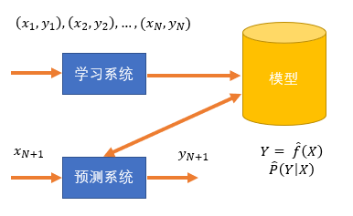
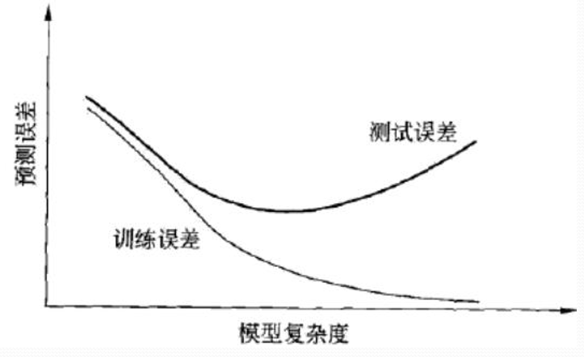

# 第一章 统计学习方法概论
## 1.1 统计学习
统计学习也称统计机器学习  
### 主要特点：  
1. 以计算机及网络为平台，建立在计算机及网络之上
2. 以数据为研究对象，是数据驱动的学科
3. 统计学习的目的是对数据进行预测和分析
4. 统计学习以方法为中心，统计学习方法构建模型并应用模型进行预测和分析
5. 统计学习是概率论、统计学、信息论、计算理论、最优化理论及计算机科学等多个领域的交叉学科

统计学习的对象是数据，从数据出发，提取数据特征，抽象出数据的模型，发现数据中的知识，又回到对数据的分析和预测中去。（数据包括各种数字、文字、图像、视频、音频数据以及它们的组合）

统计学习关于数据的基本假设是同类数据具有一定的统计规律性（统计学习的前提）

### 目的：
  用于对数据进行预测与分析，特别是对未知新数据进行预测与分析。对数据进行预测和分析是通过构建概率统计模型实现的。统计学习总的目的是考虑学习什么样的模型和如何学习模型，以使模型能对数据进行准确的预测与分析，同时尽可能提高学习效率

### 方法：
  统计学习由监督学习（supervised learning）、非监督学习（unsupervised learning）、半监督学习（semi-supervised learning）和强化学习（reinforcement learning）等组成，这里主要讨论监督学习

### 统计学习三要素：
  模型（model）、策略（strategy）和算法（algorithm）

### 实现步骤：
  1. 得到一个有限的**训练数据集合**
  2. 确定包含所有可能的模型的假设空间，即学习模型的集合
  3. 确定模型选择的准则，即学习的策略
  4. 实现求解最优模型的算法，即学习的算法
  5. 通过学习方法选择最优模型
  6. 利用学习的最优模型对新数据进行预测分析

## 1.2 监督学习
监督学习（supervised learning）的任务是学习一个模型，使模型能够对任意给定的输入，对其相应的输出做出一个好的预测
### 1.2.1 基本概念
#### 1. 输入空间、特征空间与输出空间
在监督学习中，将输入输出所有可能取值的集合分别称为**<u>输入空间</u>**与**<u>输出空间</u>**。输入输出空间可以是有限元素的集合，也可以是整个欧式空间；输入空间和输出空间可以是同一个空间，也可以是不同的空间，但通常输出空间远小于输入空间。  
每各具体的输入是一个实例（instance），通常由特征向量表示。这时，所有特征向量存在的空间称为**<u>特征空间</u>**。  
输入实例$x​$的特征向量
$$
x = 
\left(
\begin{matrix}
 x^{(1)} ,& x^{(2)} ,& \cdots ,& x^{(m)} \\
\end{matrix}
\right)^{T}
$$
训练集通常表示为
$$
T = 
\left\{
\begin{matrix}
(x_1,y_1),&(x_2,y_2),& \cdots ,& (x_N,y_N)
\end{matrix}
\right\}
$$
测试数据也由相对应的输入与输出对组成，输入与输出对又称为样本（sample）或样本点。
根据输入输出变量的不同类型，对预测任务给予不同的名称：
1. 回归问题：输入与输出变量均为连续变量
2. 分类问题：输出变量为有限个离散变量
3. 标注问题：输入与输出变量均为变量序列

#### 2. 联合概率分布
监督学习假设输入与输出的随机变量$X$和$Y$遵循联合概率分布$P(X,Y)$，$P(X,Y)$表示分布函数或者分布密度函数

#### 3.假设空间
由输入空间到输出空间的映射的集合称为假设空间。假设空间的确定意味着学习范围的确定。

监督学习的模型可以是概率模型或非概率模型，由条件概率分布$P(Y|X)$或决策函数（decision function）$Y = f(x)$表示。

### 1.2.2问题的形式化

监督学习问题

监督学习分为学习和预测两个过程，由学习系统与预测系统完成。

## 1.3 统计学习三要素
统计学习方法都是由模型、策略和算法构成的，即统计学习方法由三要素构成，可以简单地表示为  

方法=模型+策略+算法

### 1.3.1 模型
统计学习首要考虑的问题事学习什么样的模型。在监督学习过程中，模型就是索要学习的条件概率分布或决策函数。模型的假设空间(hypothesis space)包含所有可能的条件概率分布或决策函数。
### 1.3.2 策略
获取模型的假设空间后，接着需要考虑的是按照什么样的准则学习或选择最优的模型，统计学习的目的在于从假设空间中选取最优模型。  
首先引入随时函数与风险评估函数的概念。损失函数度量模型一次预测的好坏，风险函数度量平均意义下模型预测的好坏。

#### 1. 损失函数和风险函数
监督学习问题是在假设空间 $\mathcal { F }$ 中选取模型 $f$ 作为决策函数，对于给定的输入 $X$ ,由 $f(X)$ 给出的相应的输出 $Y$ ，这个输出的预测值 $f(X)$ 与真实值 $Y$ 可能一致也可能不一致，用一个损失函数（loss function）或代价函数（cost function）来度量预测错误的程度。损失函数是 $f(X)$ 和 $Y$ 的非负实值记录，记作 $L(Y,f(X))$ 。  

统计学习常用的损失函数有以下几种：  

（1）0-1损失函数（0-1 loss function）
$$
L(Y,f(X))=
\begin{cases}
1,\quad &Y\neq f(X)\\
0,\quad &Y=f(X)
\end{cases}
\tag{1.1}
$$

（2）平方损失函数（quadratic loss function）
$$
L(Y,f(X))=(Y-f(X))^2
\tag{1.2}
$$
（3）绝对损失函数（absolute loss function）
$$
L(Y,f(X))=|Y-f(X)|
\tag{1.3}
$$
（4）对数损失函数（logarithmic loss function）或对数似然损失函数（loglikelihood loss function）
$$
L(Y,P(Y|X))=-logP(Y|X)
\tag{1.4}
$$
损失函数越小，模型就越好，由于模型的输入、输出 $(X,Y)$ 是随机变量，遵循联合分布 $P(X,Y)​$ ，所以损失函数的期望是
$$
R_{exp}(f)=E_{P}[L(Y,f(X))]=\int_{\mathcal{x}\times \mathcal{y}}L(y,f(x))P(x,y)dxdy
\tag{1.5}
$$
这是理论上模型 $f(X)$ 关于联合分布 $P(X,Y)$ 的<u>平均意义</u>下的损失，称为`风险函数`（risk function）或`期望损失`（expected loss）。 

**学习的目标就是选择期望风险最小的模型。** 

由于联合分布$P(X,Y)​$是未知的，$R_{exp}(f)​$不能直接计算。而实际上，如果知道联合分布$P(X,Y)​$，可以直接求出条件概率分布$P(Y|X)​$，也就不需要学习了。这样一来，一方面根据期望风险最小学习模型要用到联合分布，另一方面联合分布又是未知的，所以监督学习就成为一个病态的问题(ill-formed problem)。    

设$R_{emp}$为$f(X)$关于训练集的平均损失，称为`经验风险`(empirical risk)或`经验损失`(empirical loss)。
$$
R_{emp}(f)=\frac{1}{N}\sum_{i=1}^{N}L(y_{i},f(x_{i}))
\tag{1.6}
$$
期望风险是模型关于联合分布的期望损失，经验风险是模型关于训练样本集的平均损失。根据大数定律，当样本容量N趋于无穷时，经验风险区域期望风险，所以我们会很自然的想到用经验风险估计期望风险。由于现实训练中样本数量有限，这一方法常常不理想，需要对经验风险进行一定的矫正，这就关系到监督学习的两个基本策略：*<u>经验风险最小化</u>*和*<u>结构风险最小化</u>*。

#### 2.经验风险最小化与结构风险最小化

经验风险最小化（empirical risk minimization, ERM）的策略认为，经验风险最小的模型是最优的模型。根据这一策略，按照经验风险最小化求最优模型就是求解最优化问题：
$$
\min_{f\in \mathcal{F}}\frac{1}{N}\sum_{i=1}^{N}L(y_{i},f(x_i))
\tag{1.7}
$$
例子：

​	`极大似然估计`（maximum likelihood estimation）。当模型是条件概率分布，损失函数是对数损失函数时，经验风险最小化就等价于极大似然估计。

当样本容量很小时，经验风险最小化学习效果就未必很好，会产生`过拟合`（over-fitting）现象。

结构风险最小化（structural risk minimization，SRM）是为了防止过拟合而提出来的策略。结构风险最小化等价于`正则化`（regularization）。结构风险在经验风险上加上表示模型复杂度的正则化项（regularizer）或罚项（penalty term）。在假设空间、损失函数以及训练数据集正确的情况下，结构风险的定义为：
$$
R_{srm}(f)=\frac{1}{N}\sum_{i=1}^{N}L(y_i,f(x_i))+\lambda J(f)
\tag{1.8}
$$
其中$J(f)$为模型的复杂度，是定义在假设空间$\mathcal{F}$上的泛函。$\lambda \geq 0​$是系数，用以权衡经验风险和模型复杂度。

例子：

​	贝叶斯结构估计中的`最大后验概率估计`（maximum posterior probability estimation，MAP）。当模型是条件概率分布、损失函数是对数损失函数、模型复杂度由模型的先验概率表示是，结构风险最小化就等价于最大后验概率估计。

### 1.3.3 算法

算法是指学习模型的具体计算方法，用于求解最优化模型。

## 1.4 模型评估与模型选择
### 1.4.1 训练误差与测试误差
不同的学习方法会给出不同模型，当损失函数给定时，基于损失函数的模型的训练误差（training error）和模型的测试误差（test error）就自然成为了学习方法评估的标准。
*注：统计学习方法具体采用的损失函数未必是评估时使用的损失函数*

### 1.4.2 过拟合与模型选择
当假设空间含有不同复杂度（参数个数不同等）的模型时，就需要进行模型选择。具体地，所选择的模型要与真模型的参数个数相同，所选择的模型的参数与真模型的参数向量相近。  
过拟合（over-fitting）：指学习时选择的模型所包含的参数过多，以至于出现这一模型对已知数据预测很好，但对未知数据预测得很差的现象。  

下图描述了训练误差和测试误差与模型的复杂度之间的关系。

## 1.5 正则化与交叉验证

### 1.5.1 正则化

模型选择的典型方法就是`正则化(regularization)`。正则化是结构风险最小化策略的实现，是在经验风险上加一个正则化项（regularizer）或罚项（penalty term）。

*正则化项一般是模型复杂度的单调递增函数*

正则化符合奥卡姆剃刀（Occam‘s razor）原理。奥卡姆剃刀原理应用于模型选择时：在所有可能选择的模型中，能够很好地解释已知数据并且十分简单的模型才是最好的模型。

#### L0与L1范数

L0范数是指向量中非0的元素的个数。

